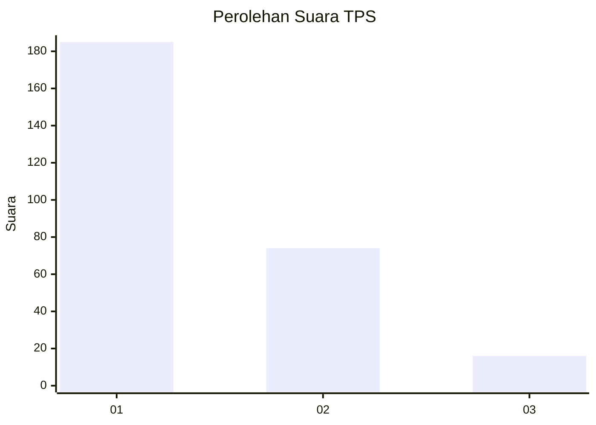
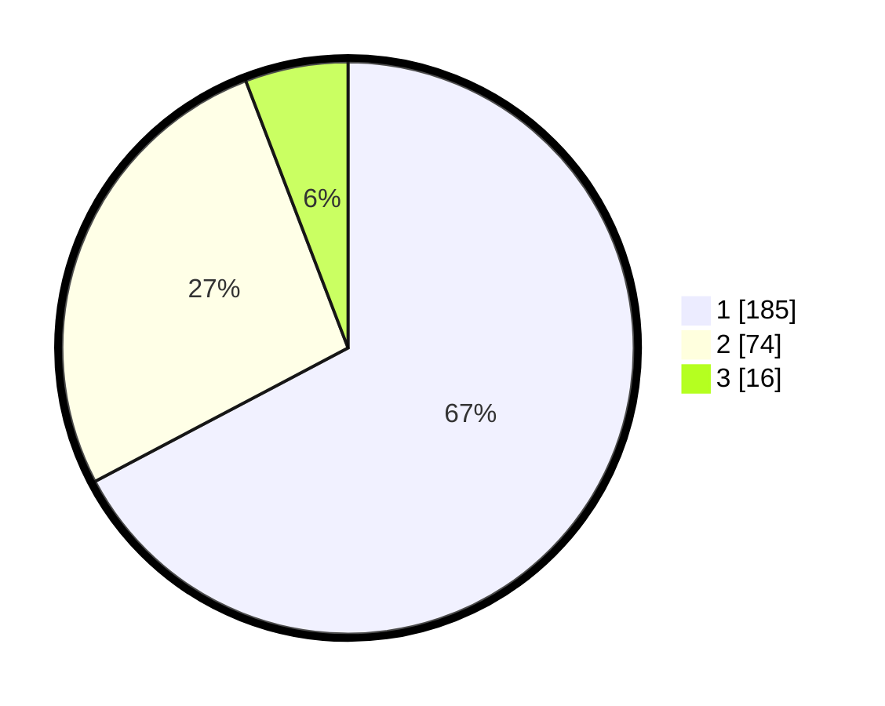

# Hasil

## Grafik

## Tabel

| No. | Nama Paslon    | Suara | Suara (raw) | Persentase |
|:--- |:-------------- | -----:| -----------:| ----------:|
| 1   | ANIES MUHAIMIN | 185   | [185][p-1]  | 67,27      |
| 2   | PRABOWO GIBRAN | 74    | [74][p-2]   | 26,91      |
| 3   | GANJAR MAHFUD  | 16    | [16][p-3]   | 5,82       |

[p-1]: https://github.com/gigit-pemilu/pemilu-2024-11-aceh/blob/main/pilpres/hitung-suara/sub/11-aceh/sub/17-bener-meriah/sub/05-bukit/sub/2027-babussalam/sub/001-tps/sub/paslon-1.txt
[p-2]: https://github.com/gigit-pemilu/pemilu-2024-11-aceh/blob/main/pilpres/hitung-suara/sub/11-aceh/sub/17-bener-meriah/sub/05-bukit/sub/2027-babussalam/sub/001-tps/sub/paslon-2.txt
[p-3]: https://github.com/gigit-pemilu/pemilu-2024-11-aceh/blob/main/pilpres/hitung-suara/sub/11-aceh/sub/17-bener-meriah/sub/05-bukit/sub/2027-babussalam/sub/001-tps/sub/paslon-3.txt

## Foto C Plano

https://sirekap-obj-formc.kpu.go.id/5e3b/pemilu/ppwp/11/17/05/20/27/1117052027001-20240215-144200--93b493e7-2daa-415d-84eb-a81d2ab4c504.jpg

https://sirekap-obj-formc.kpu.go.id/5e3b/pemilu/ppwp/11/17/05/20/27/1117052027001-20240215-144430--70e39d05-6766-4666-868b-81b726389130.jpg

https://sirekap-obj-formc.kpu.go.id/5e3b/pemilu/ppwp/11/17/05/20/27/1117052027001-20240215-110635--a0b0f183-2883-44db-9f7a-79129ceffe7d.jpg

## Metadata

| Key        | Value               |
| ---------- | ------------------- |
| Time Stamp | 2024-02-24 22:31:28 |

