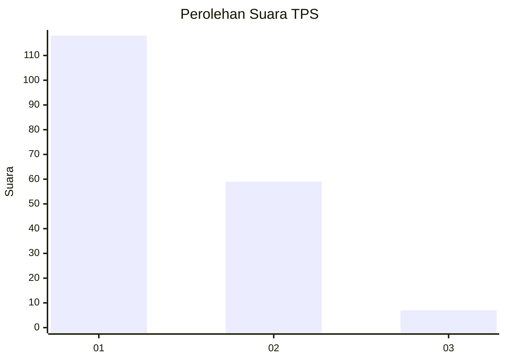
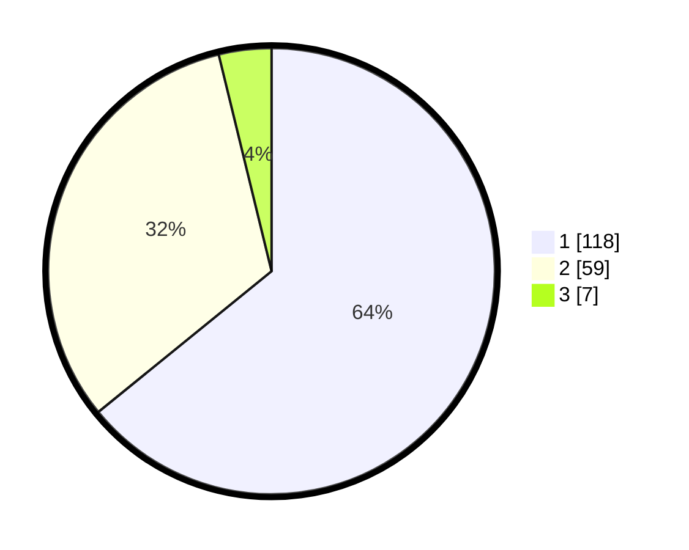

# Hasil

## Grafik

## Tabel

| No. | Nama Paslon    | Suara | Suara (raw) | Persentase |
|:--- |:-------------- | -----:| -----------:| ----------:|
| 1   | ANIES MUHAIMIN | 118   | [118][p-1]  | 64,13      |
| 2   | PRABOWO GIBRAN | 59    | [59][p-2]   | 32,07      |
| 3   | GANJAR MAHFUD  | 7     | [7][p-3]    | 3,80       |

[p-1]: https://github.com/gigit-pemilu/pemilu-2024-11-aceh/blob/main/pilpres/hitung-suara/sub/11-aceh/sub/17-bener-meriah/sub/05-bukit/sub/2028-paya-gajah/sub/001-tps/sub/paslon-1.txt
[p-2]: https://github.com/gigit-pemilu/pemilu-2024-11-aceh/blob/main/pilpres/hitung-suara/sub/11-aceh/sub/17-bener-meriah/sub/05-bukit/sub/2028-paya-gajah/sub/001-tps/sub/paslon-2.txt
[p-3]: https://github.com/gigit-pemilu/pemilu-2024-11-aceh/blob/main/pilpres/hitung-suara/sub/11-aceh/sub/17-bener-meriah/sub/05-bukit/sub/2028-paya-gajah/sub/001-tps/sub/paslon-3.txt

## Foto C Plano

https://sirekap-obj-formc.kpu.go.id/85e2/pemilu/ppwp/11/17/05/20/28/1117052028001-20240215-104835--cde699a5-df70-4201-9bf8-c267993bf35e.jpg

https://sirekap-obj-formc.kpu.go.id/85e2/pemilu/ppwp/11/17/05/20/28/1117052028001-20240214-230908--fb4a0b27-b5d9-46c9-8fc8-db874147f901.jpg

https://sirekap-obj-formc.kpu.go.id/85e2/pemilu/ppwp/11/17/05/20/28/1117052028001-20240215-105417--16f8755a-122b-4678-abb7-f5f99051f075.jpg

## Metadata

| Key        | Value               |
| ---------- | ------------------- |
| Time Stamp | 2024-02-24 22:31:28 |

