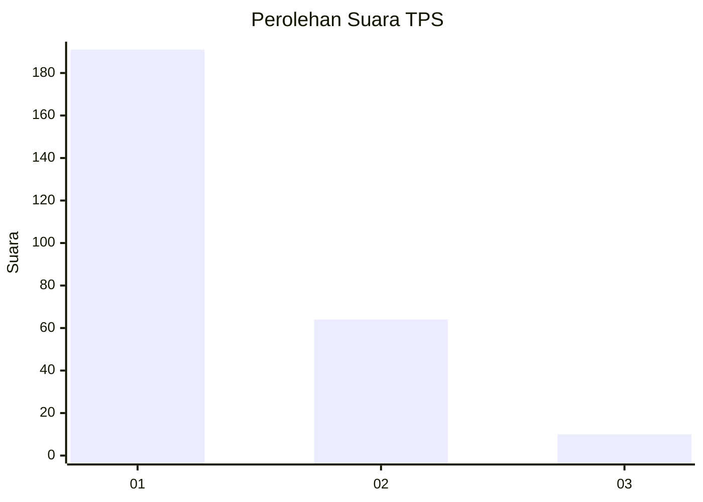
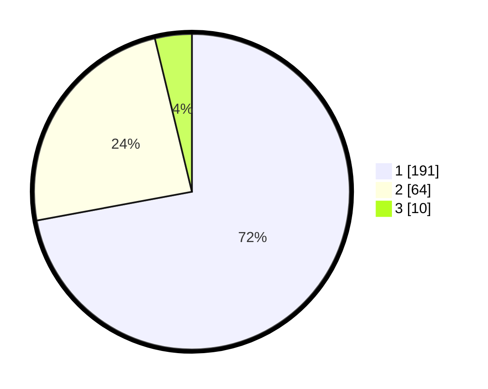

# Hasil

## Grafik

## Tabel

| No. | Nama Paslon    | Suara | Suara (raw) | Persentase |
|:--- |:-------------- | -----:| -----------:| ----------:|
| 1   | ANIES MUHAIMIN | 191   | [191][p-1]  | 72,08      |
| 2   | PRABOWO GIBRAN | 64    | [64][p-2]   | 24,15      |
| 3   | GANJAR MAHFUD  | 10    | [10][p-3]   | 3,77       |

[p-1]: https://github.com/gigit-pemilu/pemilu-2024-11-aceh/blob/main/pilpres/hitung-suara/sub/11-aceh/sub/17-bener-meriah/sub/05-bukit/sub/2031-delung-asli/sub/002-tps/sub/paslon-1.txt
[p-2]: https://github.com/gigit-pemilu/pemilu-2024-11-aceh/blob/main/pilpres/hitung-suara/sub/11-aceh/sub/17-bener-meriah/sub/05-bukit/sub/2031-delung-asli/sub/002-tps/sub/paslon-2.txt
[p-3]: https://github.com/gigit-pemilu/pemilu-2024-11-aceh/blob/main/pilpres/hitung-suara/sub/11-aceh/sub/17-bener-meriah/sub/05-bukit/sub/2031-delung-asli/sub/002-tps/sub/paslon-3.txt

## Foto C Plano

https://sirekap-obj-formc.kpu.go.id/62e5/pemilu/ppwp/11/17/05/20/31/1117052031002-20240215-090524--d4872a77-50f9-4c3d-b228-7c39caeccf1a.jpg

https://sirekap-obj-formc.kpu.go.id/62e5/pemilu/ppwp/11/17/05/20/31/1117052031002-20240215-090414--cbcaa3d0-3f71-4085-bbad-936962385ee9.jpg

https://sirekap-obj-formc.kpu.go.id/62e5/pemilu/ppwp/11/17/05/20/31/1117052031002-20240215-090252--8891cb98-4d21-4487-b80f-a8ce169b7d8a.jpg

## Metadata

| Key        | Value               |
| ---------- | ------------------- |
| Time Stamp | 2024-02-24 22:31:28 |

