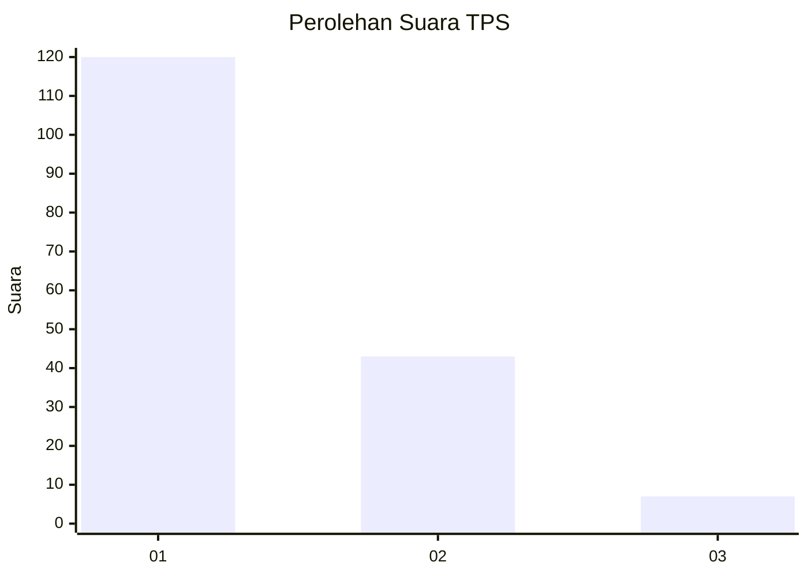
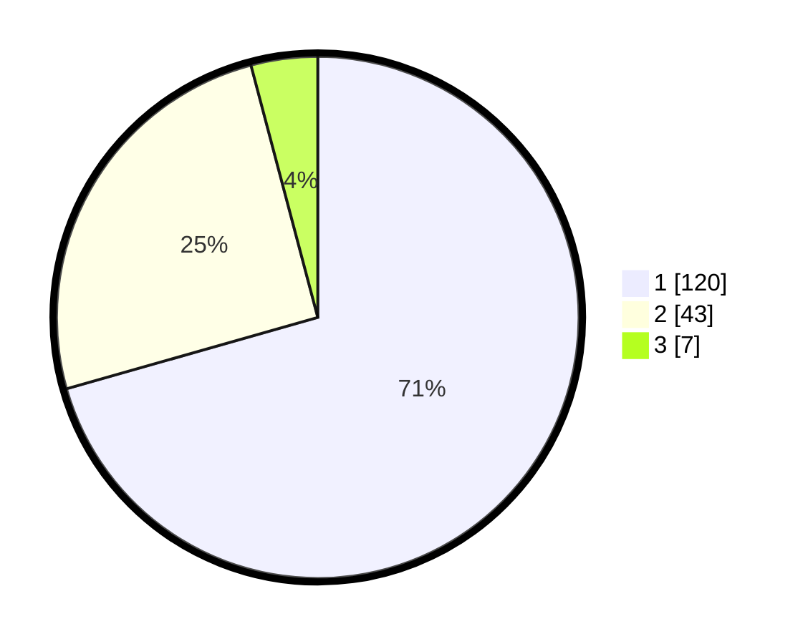

# Hasil

## Grafik

## Tabel

| No. | Nama Paslon    | Suara | Suara (raw) | Persentase |
|:--- |:-------------- | -----:| -----------:| ----------:|
| 1   | ANIES MUHAIMIN | 120   | [120][p-1]  | 70,59      |
| 2   | PRABOWO GIBRAN | 43    | [43][p-2]   | 25,29      |
| 3   | GANJAR MAHFUD  | 7     | [7][p-3]    | 4,12       |

[p-1]: https://github.com/gigit-pemilu/pemilu-2024-11-aceh/blob/main/pilpres/hitung-suara/sub/11-aceh/sub/17-bener-meriah/sub/05-bukit/sub/2032-pilar-jaya/sub/001-tps/sub/paslon-1.txt
[p-2]: https://github.com/gigit-pemilu/pemilu-2024-11-aceh/blob/main/pilpres/hitung-suara/sub/11-aceh/sub/17-bener-meriah/sub/05-bukit/sub/2032-pilar-jaya/sub/001-tps/sub/paslon-2.txt
[p-3]: https://github.com/gigit-pemilu/pemilu-2024-11-aceh/blob/main/pilpres/hitung-suara/sub/11-aceh/sub/17-bener-meriah/sub/05-bukit/sub/2032-pilar-jaya/sub/001-tps/sub/paslon-3.txt

## Foto C Plano

https://sirekap-obj-formc.kpu.go.id/629b/pemilu/ppwp/11/17/05/20/32/1117052032001-20240215-031745--decb632a-e6e3-4c66-b4d3-73781746a547.jpg

https://sirekap-obj-formc.kpu.go.id/629b/pemilu/ppwp/11/17/05/20/32/1117052032001-20240215-032405--889318b4-2e9e-401d-a4ac-8b19bf844063.jpg

https://sirekap-obj-formc.kpu.go.id/629b/pemilu/ppwp/11/17/05/20/32/1117052032001-20240215-033130--7058a027-aee6-42e6-b6e6-3301d96cf8f8.jpg

## Metadata

| Key        | Value               |
| ---------- | ------------------- |
| Time Stamp | 2024-02-24 22:31:28 |

