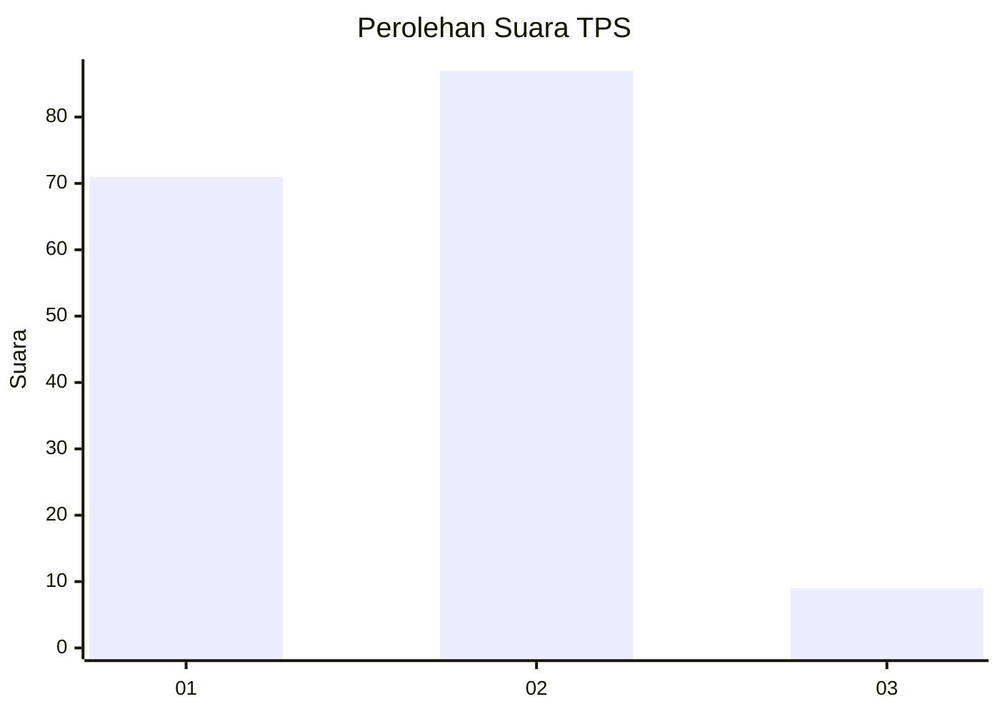
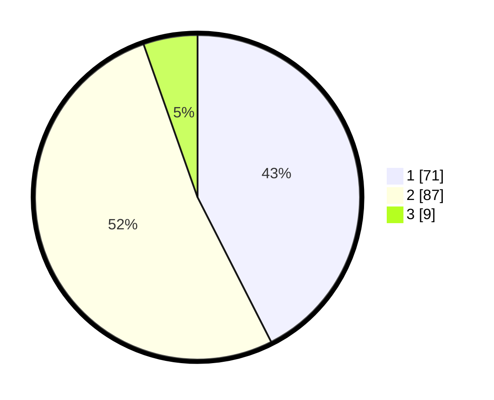

# Hasil

## Grafik

## Tabel

| No. | Nama Paslon    | Suara | Suara (raw) | Persentase |
|:--- |:-------------- | -----:| -----------:| ----------:|
| 1   | ANIES MUHAIMIN | 71    | [71][p-1]   | 42,51      |
| 2   | PRABOWO GIBRAN | 87    | [87][p-2]   | 52,10      |
| 3   | GANJAR MAHFUD  | 9     | [9][p-3]    | 5,39       |

[p-1]: https://github.com/gigit-pemilu/pemilu-2024-11-aceh/blob/main/pilpres/hitung-suara/sub/11-aceh/sub/17-bener-meriah/sub/05-bukit/sub/2035-mupakat-jadi/sub/002-tps/sub/paslon-1.txt
[p-2]: https://github.com/gigit-pemilu/pemilu-2024-11-aceh/blob/main/pilpres/hitung-suara/sub/11-aceh/sub/17-bener-meriah/sub/05-bukit/sub/2035-mupakat-jadi/sub/002-tps/sub/paslon-2.txt
[p-3]: https://github.com/gigit-pemilu/pemilu-2024-11-aceh/blob/main/pilpres/hitung-suara/sub/11-aceh/sub/17-bener-meriah/sub/05-bukit/sub/2035-mupakat-jadi/sub/002-tps/sub/paslon-3.txt

## Foto C Plano

https://sirekap-obj-formc.kpu.go.id/c77f/pemilu/ppwp/11/17/05/20/35/1117052035002-20240215-003437--eeb2d8e2-9b8f-452e-a4bc-f260cffeecc9.jpg

https://sirekap-obj-formc.kpu.go.id/c77f/pemilu/ppwp/11/17/05/20/35/1117052035002-20240215-003554--b0e0e168-226d-47f1-b1dc-b72e8a5e2279.jpg

https://sirekap-obj-formc.kpu.go.id/c77f/pemilu/ppwp/11/17/05/20/35/1117052035002-20240215-003724--c5469ed1-8e04-4f89-9f5e-cc3fd6de8791.jpg

## Metadata

| Key        | Value               |
| ---------- | ------------------- |
| Time Stamp | 2024-02-17 03:30:02 |

