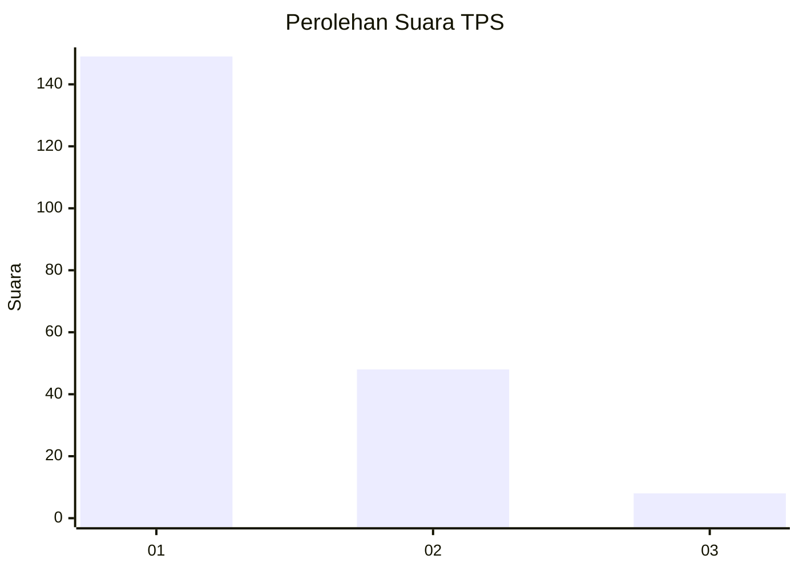
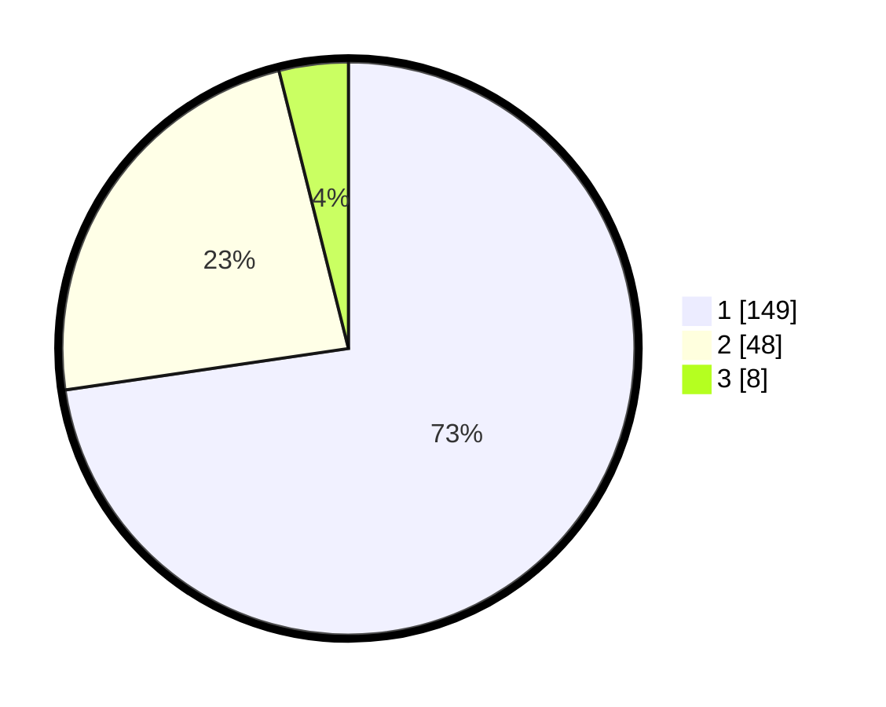

# Hasil

## Grafik

## Tabel

| No. | Nama Paslon    | Suara | Suara (raw) | Persentase |
|:--- |:-------------- | -----:| -----------:| ----------:|
| 1   | ANIES MUHAIMIN | 149   | [149][p-1]  | 72,68      |
| 2   | PRABOWO GIBRAN | 48    | [48][p-2]   | 23,41      |
| 3   | GANJAR MAHFUD  | 8     | [8][p-3]    | 3,90       |

[p-1]: https://github.com/gigit-pemilu/pemilu-2024-11-aceh/blob/main/pilpres/hitung-suara/sub/11-aceh/sub/17-bener-meriah/sub/05-bukit/sub/2037-blang-panas/sub/001-tps/sub/paslon-1.txt
[p-2]: https://github.com/gigit-pemilu/pemilu-2024-11-aceh/blob/main/pilpres/hitung-suara/sub/11-aceh/sub/17-bener-meriah/sub/05-bukit/sub/2037-blang-panas/sub/001-tps/sub/paslon-2.txt
[p-3]: https://github.com/gigit-pemilu/pemilu-2024-11-aceh/blob/main/pilpres/hitung-suara/sub/11-aceh/sub/17-bener-meriah/sub/05-bukit/sub/2037-blang-panas/sub/001-tps/sub/paslon-3.txt

## Foto C Plano

https://sirekap-obj-formc.kpu.go.id/4acf/pemilu/ppwp/11/17/05/20/37/1117052037001-20240214-233018--7a55c27f-d75f-4539-9ed5-834f691a5bb6.jpg

https://sirekap-obj-formc.kpu.go.id/4acf/pemilu/ppwp/11/17/05/20/37/1117052037001-20240214-233049--949bca83-4de7-48cd-a45b-84a1112004cf.jpg

https://sirekap-obj-formc.kpu.go.id/4acf/pemilu/ppwp/11/17/05/20/37/1117052037001-20240215-042140--da53e48a-89c9-42dd-87b4-50d7fab77ff9.jpg

## Metadata

| Key        | Value               |
| ---------- | ------------------- |
| Time Stamp | 2024-02-24 22:31:28 |

