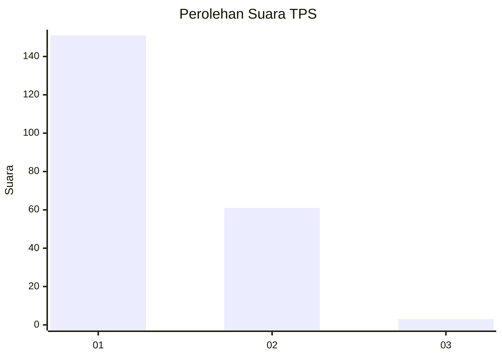
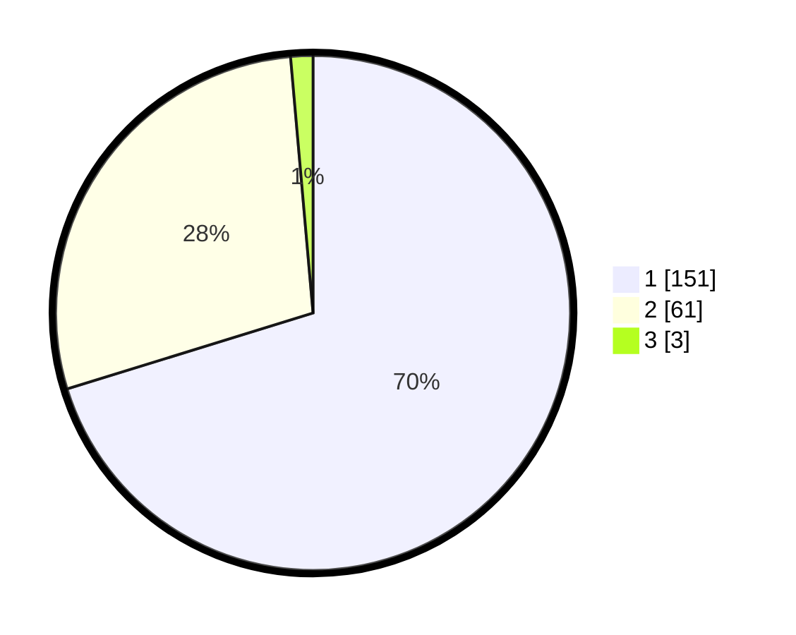

# Hasil

## Grafik

## Tabel

| No. | Nama Paslon    | Suara | Suara (raw) | Persentase |
|:--- |:-------------- | -----:| -----------:| ----------:|
| 1   | ANIES MUHAIMIN | 151   | [151][p-1]  | 70,23      |
| 2   | PRABOWO GIBRAN | 61    | [61][p-2]   | 28,37      |
| 3   | GANJAR MAHFUD  | 3     | [3][p-3]    | 1,40       |

[p-1]: https://github.com/gigit-pemilu/pemilu-2024-11-aceh/blob/main/pilpres/hitung-suara/sub/11-aceh/sub/17-bener-meriah/sub/05-bukit/sub/2037-blang-panas/sub/002-tps/sub/paslon-1.txt
[p-2]: https://github.com/gigit-pemilu/pemilu-2024-11-aceh/blob/main/pilpres/hitung-suara/sub/11-aceh/sub/17-bener-meriah/sub/05-bukit/sub/2037-blang-panas/sub/002-tps/sub/paslon-2.txt
[p-3]: https://github.com/gigit-pemilu/pemilu-2024-11-aceh/blob/main/pilpres/hitung-suara/sub/11-aceh/sub/17-bener-meriah/sub/05-bukit/sub/2037-blang-panas/sub/002-tps/sub/paslon-3.txt

## Foto C Plano

https://sirekap-obj-formc.kpu.go.id/fe70/pemilu/ppwp/11/17/05/20/37/1117052037002-20240215-022315--4b5ff827-8cab-445c-aa1f-24f2860e9576.jpg

https://sirekap-obj-formc.kpu.go.id/fe70/pemilu/ppwp/11/17/05/20/37/1117052037002-20240215-022415--98567fbb-2181-4353-aa9a-5ecb9c6fd5ba.jpg

https://sirekap-obj-formc.kpu.go.id/fe70/pemilu/ppwp/11/17/05/20/37/1117052037002-20240215-022549--7c6251f6-538b-4bfe-b13d-98badee8e8ae.jpg

## Metadata

| Key        | Value               |
| ---------- | ------------------- |
| Time Stamp | 2024-02-24 22:31:28 |

