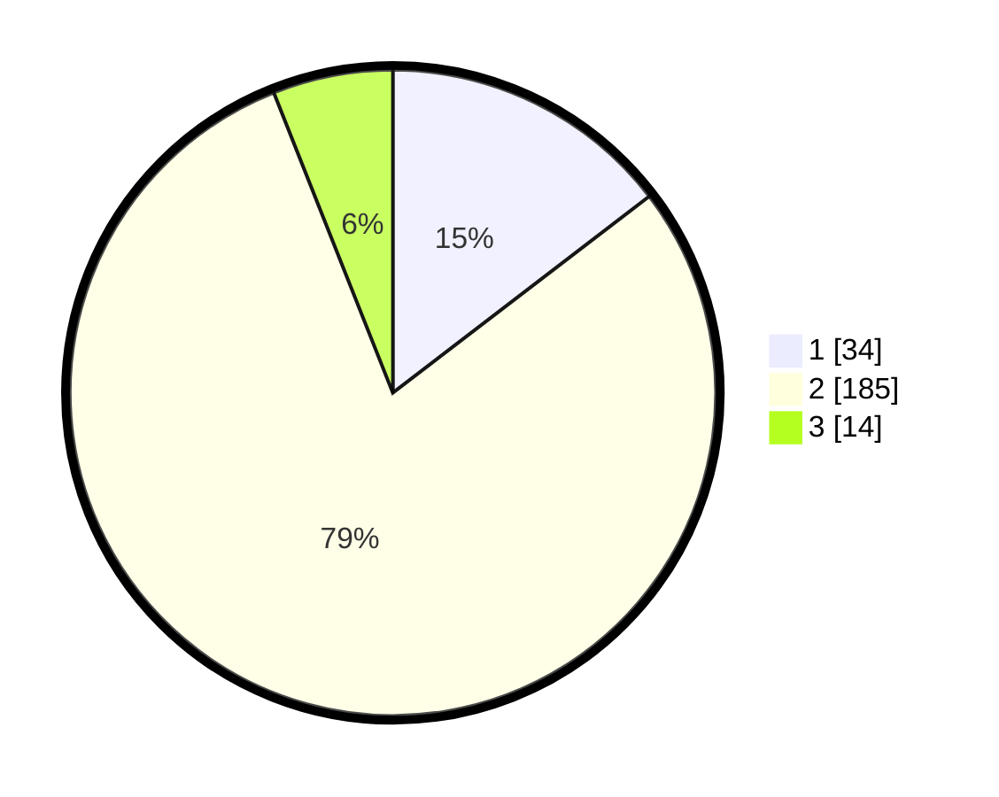

# Hasil

## Grafik

## Tabel

| No. | Nama Paslon    | Suara | Suara (raw) | Persentase |
|:--- |:-------------- | -----:| -----------:| ----------:|
| 1   | ANIES MUHAIMIN | 34    | [34][p-1]   | 14,59      |
| 2   | PRABOWO GIBRAN | 185   | [185][p-2]  | 79,40      |
| 3   | GANJAR MAHFUD  | 14    | [14][p-3]   | 6,01       |

[p-1]: https://github.com/gigit-pemilu/pemilu-2024-11-aceh/blob/main/pilpres/hitung-suara/sub/11-aceh/sub/17-bener-meriah/sub/06-wih-pesam/sub/2001-blang-paku/sub/002-tps/sub/paslon-1.txt
[p-2]: https://github.com/gigit-pemilu/pemilu-2024-11-aceh/blob/main/pilpres/hitung-suara/sub/11-aceh/sub/17-bener-meriah/sub/06-wih-pesam/sub/2001-blang-paku/sub/002-tps/sub/paslon-2.txt
[p-3]: https://github.com/gigit-pemilu/pemilu-2024-11-aceh/blob/main/pilpres/hitung-suara/sub/11-aceh/sub/17-bener-meriah/sub/06-wih-pesam/sub/2001-blang-paku/sub/002-tps/sub/paslon-3.txt

## Foto C Plano

https://sirekap-obj-formc.kpu.go.id/82b3/pemilu/ppwp/11/17/06/20/01/1117062001002-20240215-062043--cd835a4e-09ed-46a0-8750-4cba7c78f4b2.jpg

https://sirekap-obj-formc.kpu.go.id/82b3/pemilu/ppwp/11/17/06/20/01/1117062001002-20240215-062154--ac578f91-7a93-490e-835d-abe0a99dde9f.jpg

https://sirekap-obj-formc.kpu.go.id/82b3/pemilu/ppwp/11/17/06/20/01/1117062001002-20240215-062337--4c4568df-1714-44a3-b4ba-fced3e254508.jpg

## Metadata

| Key        | Value               |
| ---------- | ------------------- |
| Time Stamp | 2024-02-24 22:31:28 |

