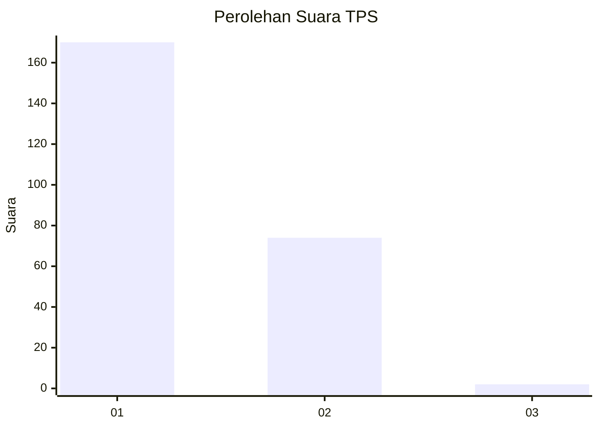
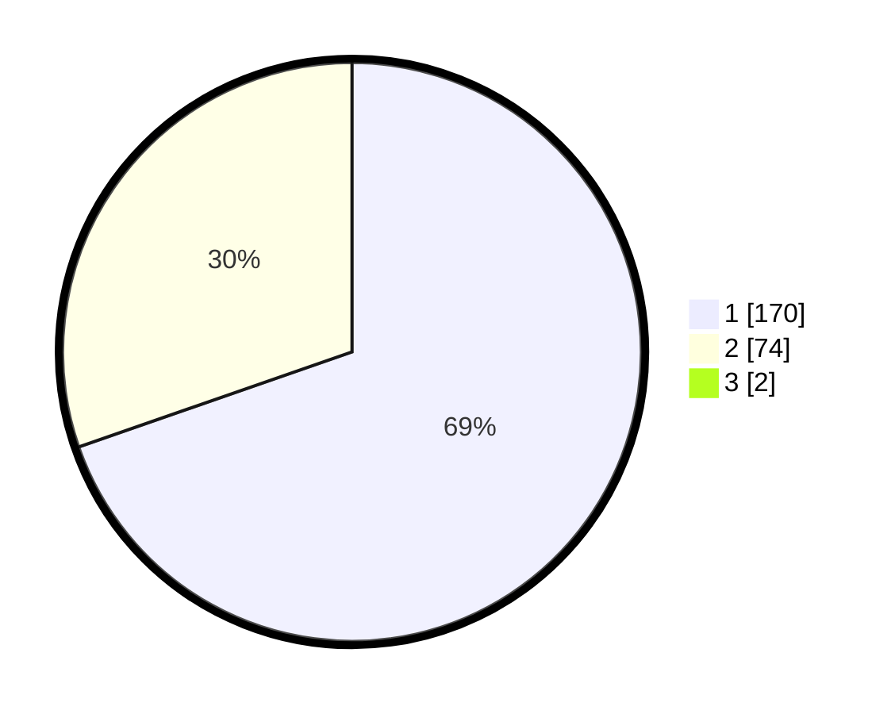

# Hasil

## Grafik

## Tabel

| No. | Nama Paslon    | Suara | Suara (raw) | Persentase |
|:--- |:-------------- | -----:| -----------:| ----------:|
| 1   | ANIES MUHAIMIN | 170   | [170][p-1]  | 69,11      |
| 2   | PRABOWO GIBRAN | 74    | [74][p-2]   | 30,08      |
| 3   | GANJAR MAHFUD  | 2     | [2][p-3]    | 0,81       |

[p-1]: https://github.com/gigit-pemilu/pemilu-2024-11-aceh/blob/main/pilpres/hitung-suara/sub/11-aceh/sub/17-bener-meriah/sub/06-wih-pesam/sub/2004-pante-raya/sub/006-tps/sub/paslon-1.txt
[p-2]: https://github.com/gigit-pemilu/pemilu-2024-11-aceh/blob/main/pilpres/hitung-suara/sub/11-aceh/sub/17-bener-meriah/sub/06-wih-pesam/sub/2004-pante-raya/sub/006-tps/sub/paslon-2.txt
[p-3]: https://github.com/gigit-pemilu/pemilu-2024-11-aceh/blob/main/pilpres/hitung-suara/sub/11-aceh/sub/17-bener-meriah/sub/06-wih-pesam/sub/2004-pante-raya/sub/006-tps/sub/paslon-3.txt

## Foto C Plano

https://sirekap-obj-formc.kpu.go.id/684e/pemilu/ppwp/11/17/06/20/04/1117062004006-20240215-085411--37db6fb5-e419-42c8-af31-e86b8f39346a.jpg

https://sirekap-obj-formc.kpu.go.id/684e/pemilu/ppwp/11/17/06/20/04/1117062004006-20240215-084718--8a8d4924-4af6-4ad9-8289-31a3d3866abf.jpg

https://sirekap-obj-formc.kpu.go.id/684e/pemilu/ppwp/11/17/06/20/04/1117062004006-20240215-085019--2b009276-73d6-473a-98de-e45f9c4af877.jpg

## Metadata

| Key        | Value               |
| ---------- | ------------------- |
| Time Stamp | 2024-02-24 22:31:28 |

