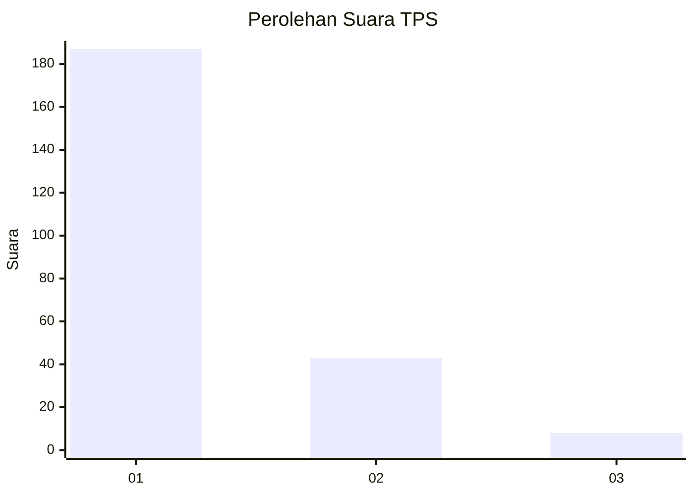
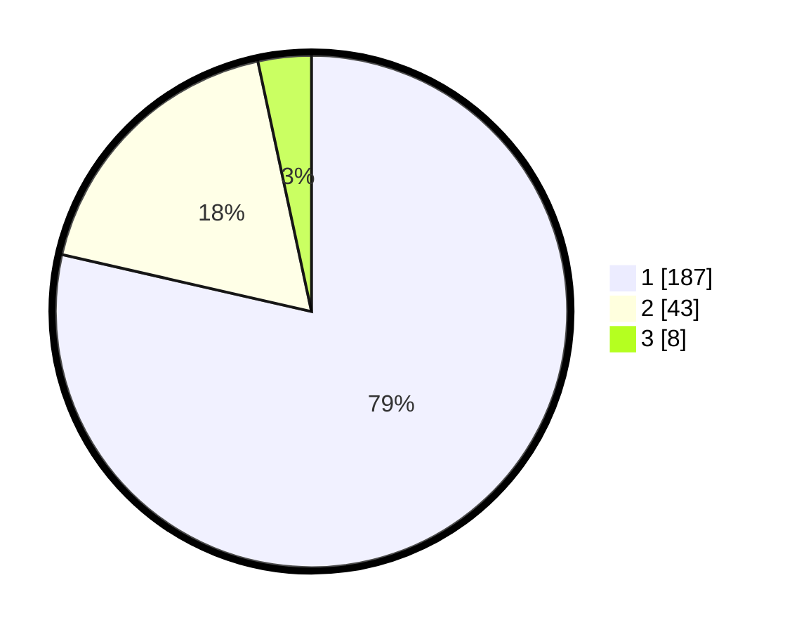

# Hasil

## Grafik

## Tabel

| No. | Nama Paslon    | Suara | Suara (raw) | Persentase |
|:--- |:-------------- | -----:| -----------:| ----------:|
| 1   | ANIES MUHAIMIN | 187   | [187][p-1]  | 78,57      |
| 2   | PRABOWO GIBRAN | 43    | [43][p-2]   | 18,07      |
| 3   | GANJAR MAHFUD  | 8     | [8][p-3]    | 3,36       |

[p-1]: https://github.com/gigit-pemilu/pemilu-2024-11-aceh/blob/main/pilpres/hitung-suara/sub/11-aceh/sub/17-bener-meriah/sub/06-wih-pesam/sub/2005-simpang-balek/sub/001-tps/sub/paslon-1.txt
[p-2]: https://github.com/gigit-pemilu/pemilu-2024-11-aceh/blob/main/pilpres/hitung-suara/sub/11-aceh/sub/17-bener-meriah/sub/06-wih-pesam/sub/2005-simpang-balek/sub/001-tps/sub/paslon-2.txt
[p-3]: https://github.com/gigit-pemilu/pemilu-2024-11-aceh/blob/main/pilpres/hitung-suara/sub/11-aceh/sub/17-bener-meriah/sub/06-wih-pesam/sub/2005-simpang-balek/sub/001-tps/sub/paslon-3.txt

## Foto C Plano

https://sirekap-obj-formc.kpu.go.id/556a/pemilu/ppwp/11/17/06/20/05/1117062005001-20240215-052607--e50dfd78-bdac-4a45-830a-6adff55b8ac1.jpg

https://sirekap-obj-formc.kpu.go.id/556a/pemilu/ppwp/11/17/06/20/05/1117062005001-20240214-221022--0c7189da-b1ba-43ef-92cc-537af970d40c.jpg

https://sirekap-obj-formc.kpu.go.id/556a/pemilu/ppwp/11/17/06/20/05/1117062005001-20240214-221222--e7d563ce-cb8b-4fed-be41-aa436aa2862a.jpg

## Metadata

| Key        | Value               |
| ---------- | ------------------- |
| Time Stamp | 2024-02-24 22:31:28 |

