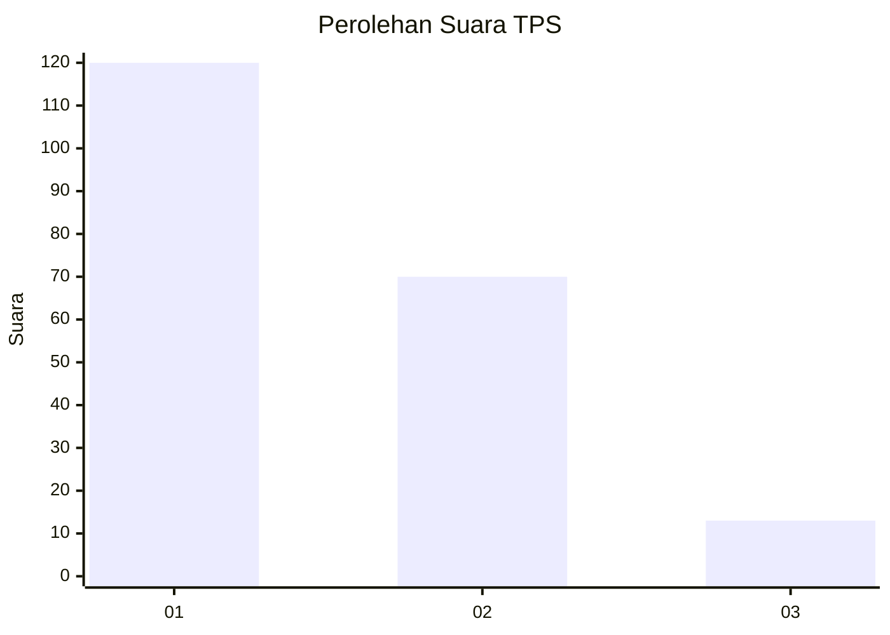
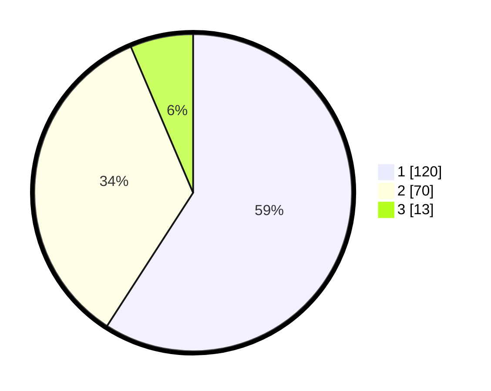

# Hasil

## Grafik

## Tabel

| No. | Nama Paslon    | Suara | Suara (raw) | Persentase |
|:--- |:-------------- | -----:| -----------:| ----------:|
| 1   | ANIES MUHAIMIN | 120   | [120][p-1]  | 59,11      |
| 2   | PRABOWO GIBRAN | 70    | [70][p-2]   | 34,48      |
| 3   | GANJAR MAHFUD  | 13    | [13][p-3]   | 6,40       |

[p-1]: https://github.com/gigit-pemilu/pemilu-2024-11-aceh/blob/main/pilpres/hitung-suara/sub/11-aceh/sub/17-bener-meriah/sub/06-wih-pesam/sub/2006-simpang-teritit/sub/003-tps/sub/paslon-1.txt
[p-2]: https://github.com/gigit-pemilu/pemilu-2024-11-aceh/blob/main/pilpres/hitung-suara/sub/11-aceh/sub/17-bener-meriah/sub/06-wih-pesam/sub/2006-simpang-teritit/sub/003-tps/sub/paslon-2.txt
[p-3]: https://github.com/gigit-pemilu/pemilu-2024-11-aceh/blob/main/pilpres/hitung-suara/sub/11-aceh/sub/17-bener-meriah/sub/06-wih-pesam/sub/2006-simpang-teritit/sub/003-tps/sub/paslon-3.txt

## Foto C Plano

https://sirekap-obj-formc.kpu.go.id/4be5/pemilu/ppwp/11/17/06/20/06/1117062006003-20240215-031952--c24f7254-3528-41e5-ac98-bb74a39d936f.jpg

https://sirekap-obj-formc.kpu.go.id/4be5/pemilu/ppwp/11/17/06/20/06/1117062006003-20240215-032058--260164f8-2ab2-469c-923e-13796530f205.jpg

https://sirekap-obj-formc.kpu.go.id/4be5/pemilu/ppwp/11/17/06/20/06/1117062006003-20240215-032203--8be42dd2-df7b-431d-9ae8-6366b9a150a2.jpg

## Metadata

| Key        | Value               |
| ---------- | ------------------- |
| Time Stamp | 2024-02-25 12:00:00 |

