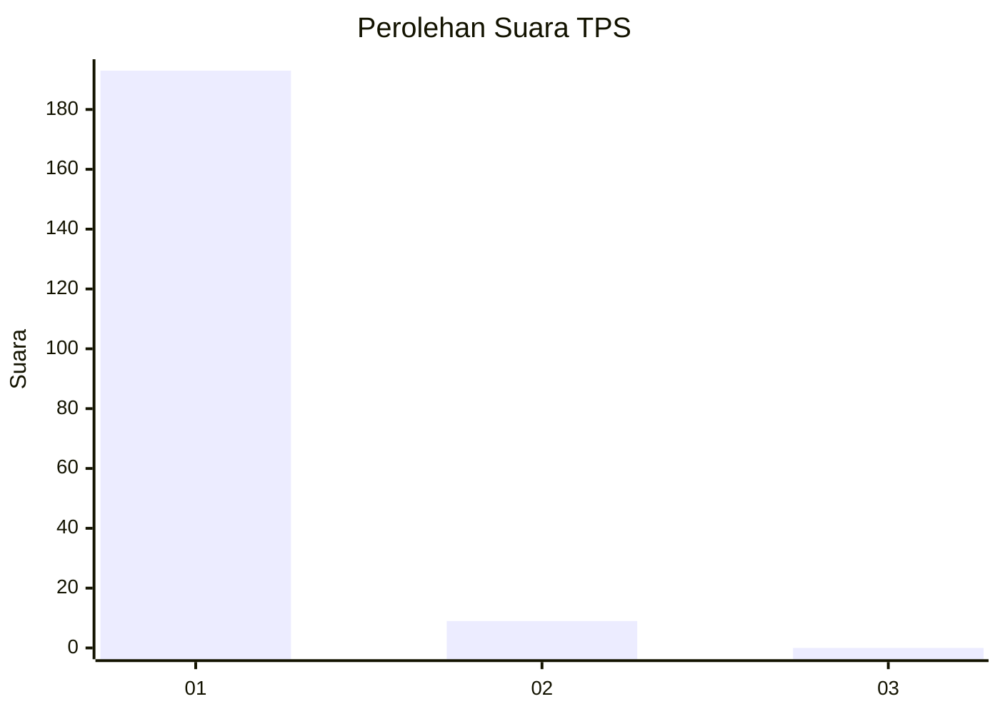
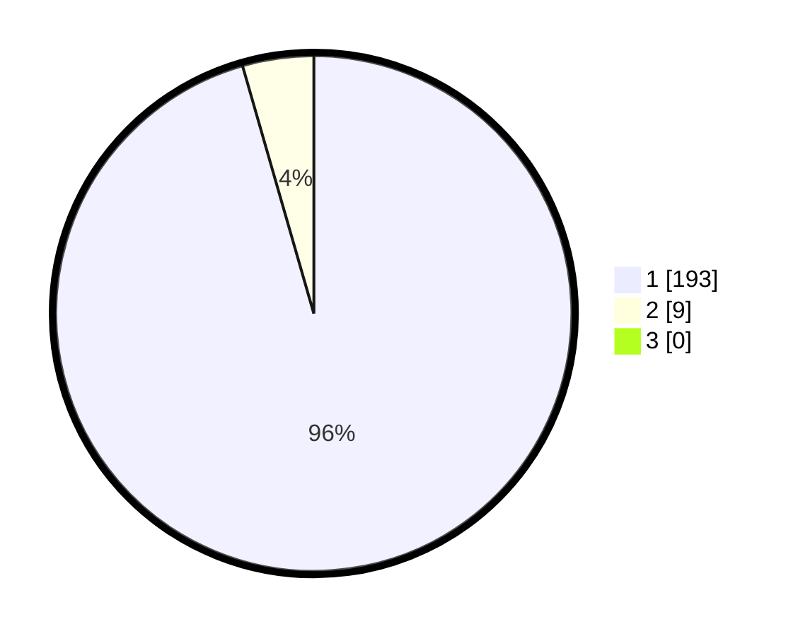

# Hasil

## Grafik

## Tabel

| No. | Nama Paslon    | Suara | Suara (raw) | Persentase |
|:--- |:-------------- | -----:| -----------:| ----------:|
| 1   | ANIES MUHAIMIN | 193   | [193][p-1]  | 95,54      |
| 2   | PRABOWO GIBRAN | 9     | [9][p-2]    | 4,46       |
| 3   | GANJAR MAHFUD  | 0     | [0][p-3]    | 0,00       |

[p-1]: https://github.com/gigit-pemilu/pemilu-2024-11-aceh/blob/main/pilpres/hitung-suara/sub/11-aceh/sub/17-bener-meriah/sub/06-wih-pesam/sub/2011-syura-jadi/sub/002-tps/sub/paslon-1.txt
[p-2]: https://github.com/gigit-pemilu/pemilu-2024-11-aceh/blob/main/pilpres/hitung-suara/sub/11-aceh/sub/17-bener-meriah/sub/06-wih-pesam/sub/2011-syura-jadi/sub/002-tps/sub/paslon-2.txt
[p-3]: https://github.com/gigit-pemilu/pemilu-2024-11-aceh/blob/main/pilpres/hitung-suara/sub/11-aceh/sub/17-bener-meriah/sub/06-wih-pesam/sub/2011-syura-jadi/sub/002-tps/sub/paslon-3.txt

## Foto C Plano

https://sirekap-obj-formc.kpu.go.id/fee7/pemilu/ppwp/11/17/06/20/11/1117062011002-20240215-095630--c75ba0e2-f3d1-4d8a-ab92-a1af84e76351.jpg

https://sirekap-obj-formc.kpu.go.id/fee7/pemilu/ppwp/11/17/06/20/11/1117062011002-20240215-095720--517f811f-16e3-4eee-a20e-9e5b941d759b.jpg

https://sirekap-obj-formc.kpu.go.id/fee7/pemilu/ppwp/11/17/06/20/11/1117062011002-20240215-095824--461e54e6-d0ac-45e5-9356-ffdabb83fd95.jpg

## Metadata

| Key        | Value               |
| ---------- | ------------------- |
| Time Stamp | 2024-02-24 22:31:28 |

