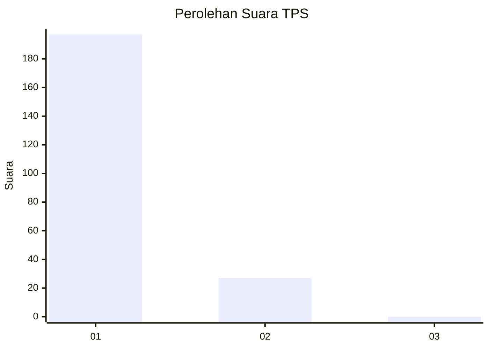
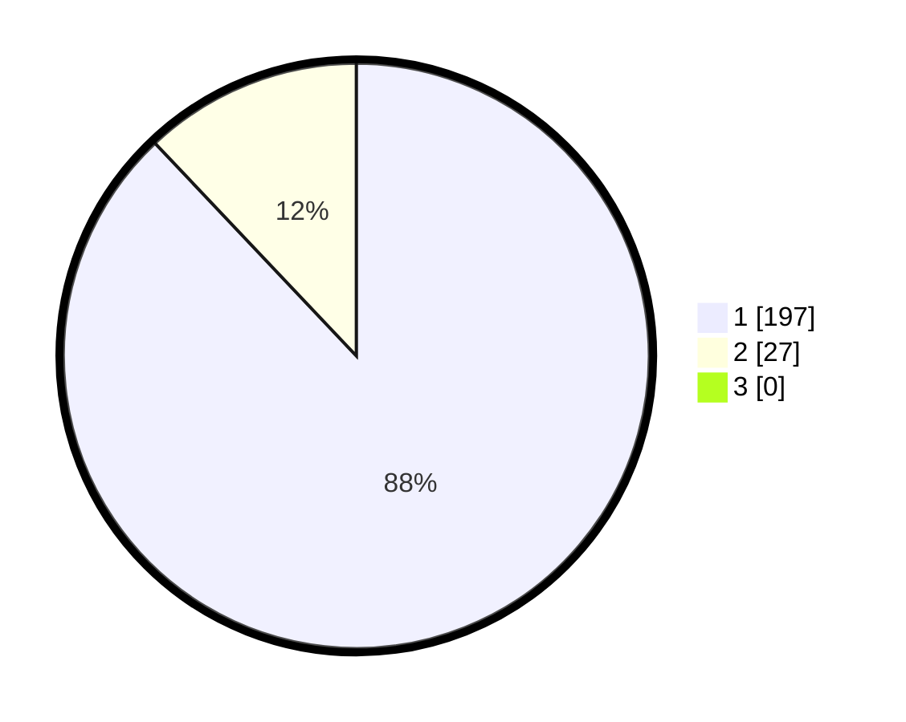

# Hasil

## Grafik

## Tabel

| No. | Nama Paslon    | Suara | Suara (raw) | Persentase |
|:--- |:-------------- | -----:| -----------:| ----------:|
| 1   | ANIES MUHAIMIN | 197   | [197][p-1]  | 87,95      |
| 2   | PRABOWO GIBRAN | 27    | [27][p-2]   | 12,05      |
| 3   | GANJAR MAHFUD  | 0     | [0][p-3]    | 0,00       |

[p-1]: https://github.com/gigit-pemilu/pemilu-2024-11-aceh/blob/main/pilpres/hitung-suara/sub/11-aceh/sub/17-bener-meriah/sub/06-wih-pesam/sub/2011-syura-jadi/sub/003-tps/sub/paslon-1.txt
[p-2]: https://github.com/gigit-pemilu/pemilu-2024-11-aceh/blob/main/pilpres/hitung-suara/sub/11-aceh/sub/17-bener-meriah/sub/06-wih-pesam/sub/2011-syura-jadi/sub/003-tps/sub/paslon-2.txt
[p-3]: https://github.com/gigit-pemilu/pemilu-2024-11-aceh/blob/main/pilpres/hitung-suara/sub/11-aceh/sub/17-bener-meriah/sub/06-wih-pesam/sub/2011-syura-jadi/sub/003-tps/sub/paslon-3.txt

## Foto C Plano

https://sirekap-obj-formc.kpu.go.id/75ad/pemilu/ppwp/11/17/06/20/11/1117062011003-20240215-050913--76c55f6c-eb83-4f51-9e01-9e328de65f32.jpg

https://sirekap-obj-formc.kpu.go.id/75ad/pemilu/ppwp/11/17/06/20/11/1117062011003-20240216-132906--7fd06101-6f8d-4793-bf50-23c23345ee8c.jpg

https://sirekap-obj-formc.kpu.go.id/75ad/pemilu/ppwp/11/17/06/20/11/1117062011003-20240216-132905--5f1c5aaa-9cf8-421a-8246-50ce2a02c0d7.jpg

## Metadata

| Key        | Value               |
| ---------- | ------------------- |
| Time Stamp | 2024-02-16 22:01:00 |

