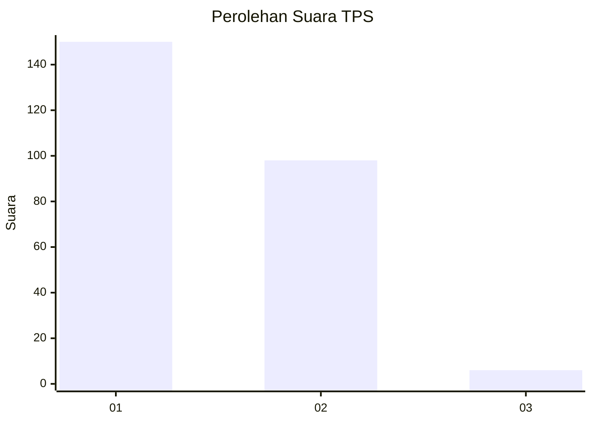
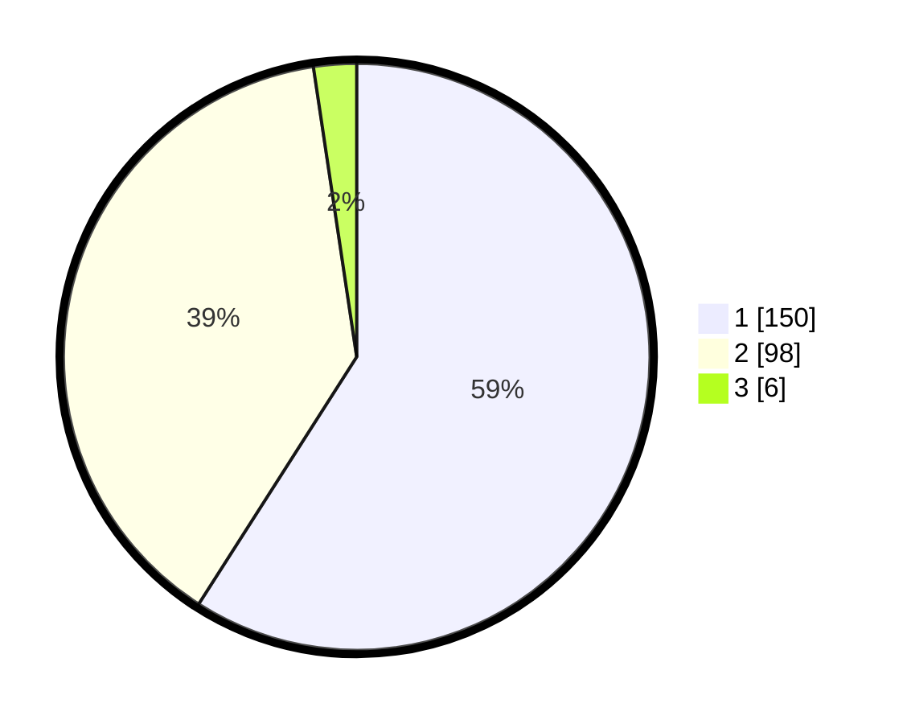

# Hasil

## Grafik

## Tabel

| No. | Nama Paslon    | Suara | Suara (raw) | Persentase |
|:--- |:-------------- | -----:| -----------:| ----------:|
| 1   | ANIES MUHAIMIN | 150   | [150][p-1]  | 59,06      |
| 2   | PRABOWO GIBRAN | 98    | [98][p-2]   | 38,58      |
| 3   | GANJAR MAHFUD  | 6     | [6][p-3]    | 2,36       |

[p-1]: https://github.com/gigit-pemilu/pemilu-2024-11-aceh/blob/main/pilpres/hitung-suara/sub/11-aceh/sub/17-bener-meriah/sub/06-wih-pesam/sub/2018-cinta-damai/sub/001-tps/sub/paslon-1.txt
[p-2]: https://github.com/gigit-pemilu/pemilu-2024-11-aceh/blob/main/pilpres/hitung-suara/sub/11-aceh/sub/17-bener-meriah/sub/06-wih-pesam/sub/2018-cinta-damai/sub/001-tps/sub/paslon-2.txt
[p-3]: https://github.com/gigit-pemilu/pemilu-2024-11-aceh/blob/main/pilpres/hitung-suara/sub/11-aceh/sub/17-bener-meriah/sub/06-wih-pesam/sub/2018-cinta-damai/sub/001-tps/sub/paslon-3.txt

## Foto C Plano

https://sirekap-obj-formc.kpu.go.id/8794/pemilu/ppwp/11/17/06/20/18/1117062018001-20240215-095746--43e7bbcc-f38e-4e91-a448-c18c3669a28b.jpg

https://sirekap-obj-formc.kpu.go.id/8794/pemilu/ppwp/11/17/06/20/18/1117062018001-20240215-095918--fb7b9ab7-68aa-409f-91e4-7e30339319c9.jpg

https://sirekap-obj-formc.kpu.go.id/8794/pemilu/ppwp/11/17/06/20/18/1117062018001-20240215-100043--aca027bf-a4bb-4580-974e-b8a5fbf7fbcd.jpg

## Metadata

| Key        | Value               |
| ---------- | ------------------- |
| Time Stamp | 2024-02-24 22:31:28 |

