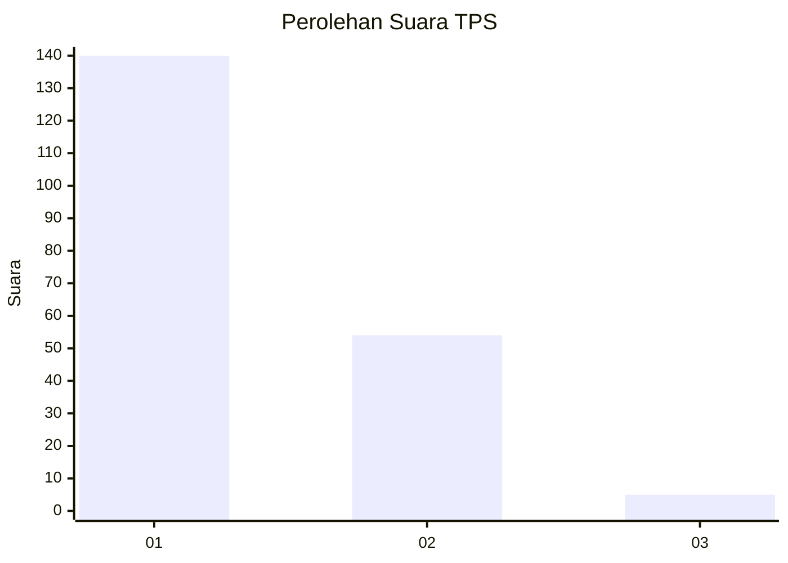
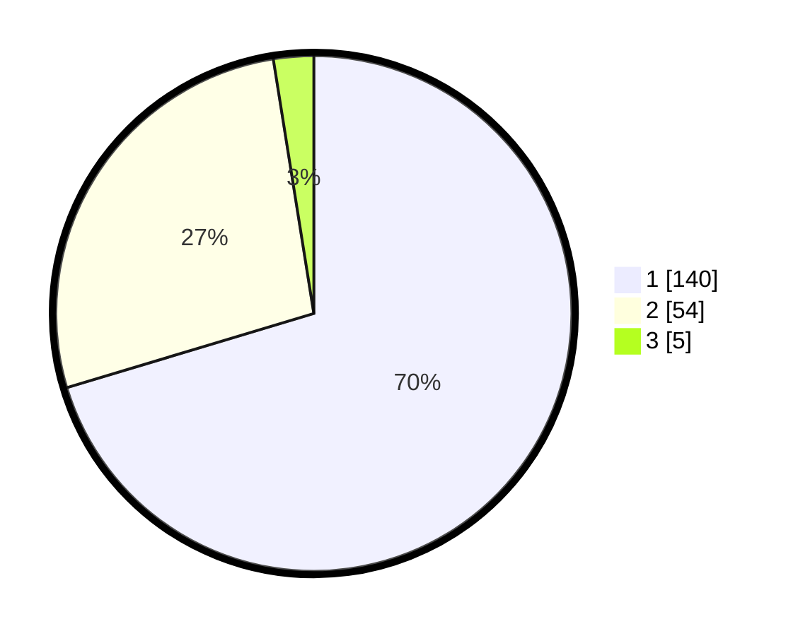

# Hasil

## Grafik

## Tabel

| No. | Nama Paslon    | Suara | Suara (raw) | Persentase |
|:--- |:-------------- | -----:| -----------:| ----------:|
| 1   | ANIES MUHAIMIN | 140   | [140][p-1]  | 70,35      |
| 2   | PRABOWO GIBRAN | 54    | [54][p-2]   | 27,14      |
| 3   | GANJAR MAHFUD  | 5     | [5][p-3]    | 2,51       |

[p-1]: https://github.com/gigit-pemilu/pemilu-2024-11-aceh/blob/main/pilpres/hitung-suara/sub/11-aceh/sub/17-bener-meriah/sub/06-wih-pesam/sub/2019-bener-ayu/sub/002-tps/sub/paslon-1.txt
[p-2]: https://github.com/gigit-pemilu/pemilu-2024-11-aceh/blob/main/pilpres/hitung-suara/sub/11-aceh/sub/17-bener-meriah/sub/06-wih-pesam/sub/2019-bener-ayu/sub/002-tps/sub/paslon-2.txt
[p-3]: https://github.com/gigit-pemilu/pemilu-2024-11-aceh/blob/main/pilpres/hitung-suara/sub/11-aceh/sub/17-bener-meriah/sub/06-wih-pesam/sub/2019-bener-ayu/sub/002-tps/sub/paslon-3.txt

## Foto C Plano

https://sirekap-obj-formc.kpu.go.id/cb2d/pemilu/ppwp/11/17/06/20/19/1117062019002-20240217-200041--aeba14c9-a1bc-4fac-bbcc-fc6c2177cf4f.jpg

https://sirekap-obj-formc.kpu.go.id/cb2d/pemilu/ppwp/11/17/06/20/19/1117062019002-20240215-022410--4373b01e-ad3b-4094-aba9-9b23980aacc3.jpg

https://sirekap-obj-formc.kpu.go.id/cb2d/pemilu/ppwp/11/17/06/20/19/1117062019002-20240214-210136--94c7566b-2913-4862-b380-79f8a6fa5d71.jpg

## Metadata

| Key        | Value               |
| ---------- | ------------------- |
| Time Stamp | 2024-02-24 22:31:28 |

