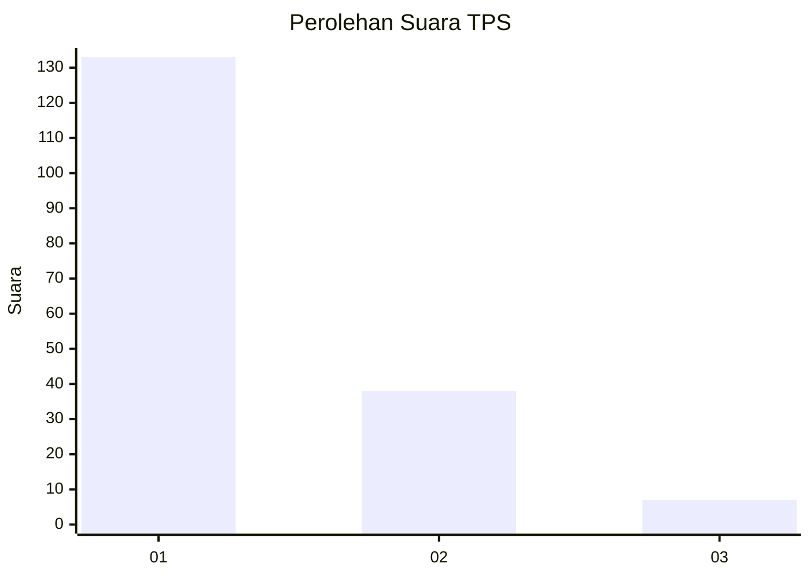
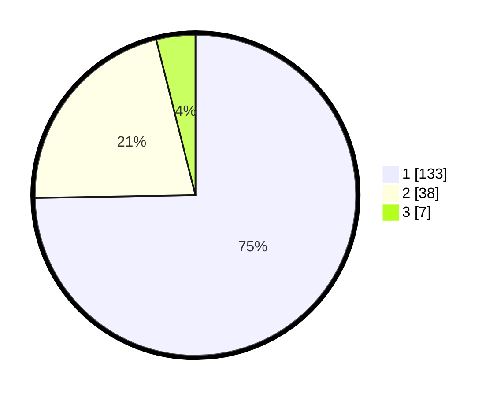

# Hasil

## Grafik

## Tabel

| No. | Nama Paslon    | Suara | Suara (raw) | Persentase |
|:--- |:-------------- | -----:| -----------:| ----------:|
| 1   | ANIES MUHAIMIN | 133   | [133][p-1]  | 74,72      |
| 2   | PRABOWO GIBRAN | 38    | [38][p-2]   | 21,35      |
| 3   | GANJAR MAHFUD  | 7     | [7][p-3]    | 3,93       |

[p-1]: https://github.com/gigit-pemilu/pemilu-2024-11-aceh/blob/main/pilpres/hitung-suara/sub/11-aceh/sub/17-bener-meriah/sub/06-wih-pesam/sub/2028-burni-telong/sub/001-tps/sub/paslon-1.txt
[p-2]: https://github.com/gigit-pemilu/pemilu-2024-11-aceh/blob/main/pilpres/hitung-suara/sub/11-aceh/sub/17-bener-meriah/sub/06-wih-pesam/sub/2028-burni-telong/sub/001-tps/sub/paslon-2.txt
[p-3]: https://github.com/gigit-pemilu/pemilu-2024-11-aceh/blob/main/pilpres/hitung-suara/sub/11-aceh/sub/17-bener-meriah/sub/06-wih-pesam/sub/2028-burni-telong/sub/001-tps/sub/paslon-3.txt

## Foto C Plano

https://sirekap-obj-formc.kpu.go.id/13d7/pemilu/ppwp/11/17/06/20/28/1117062028001-20240214-231825--5de71ed5-7718-474d-a9a7-c083c8ce585d.jpg

https://sirekap-obj-formc.kpu.go.id/13d7/pemilu/ppwp/11/17/06/20/28/1117062028001-20240214-231903--91118ff0-8450-4ca7-8bc1-6701681c568b.jpg

https://sirekap-obj-formc.kpu.go.id/13d7/pemilu/ppwp/11/17/06/20/28/1117062028001-20240214-231927--127b0b37-1d97-4445-bad7-acdfed719ee6.jpg

## Metadata

| Key        | Value               |
| ---------- | ------------------- |
| Time Stamp | 2024-02-15 12:00:28 |

