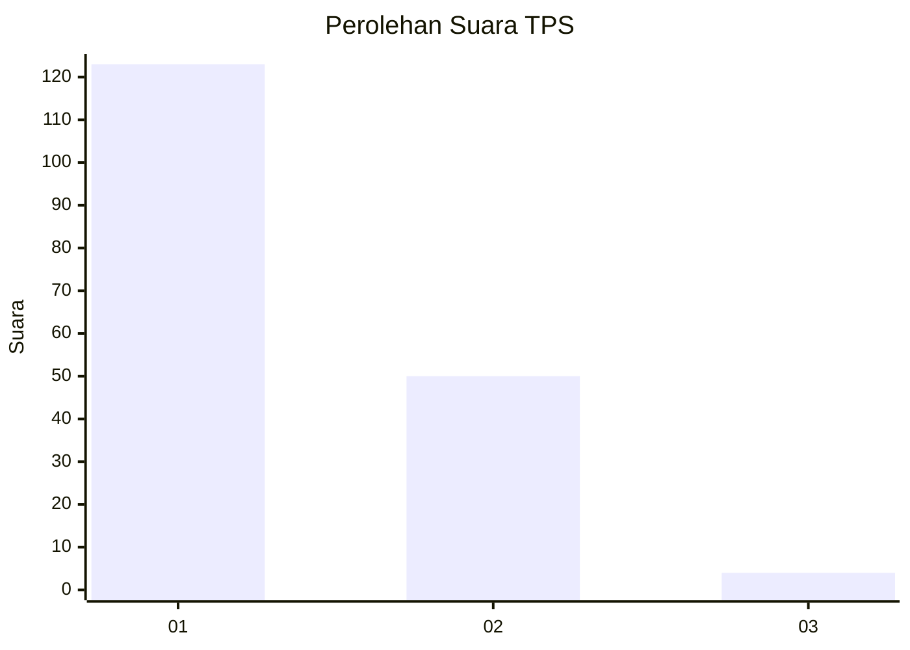
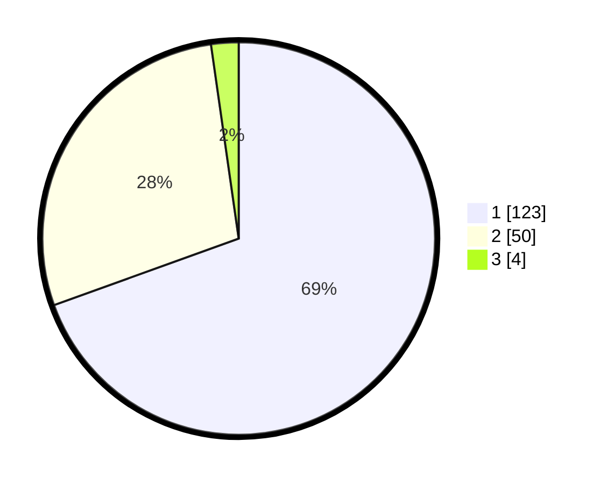

# Hasil

## Grafik

## Tabel

| No. | Nama Paslon    | Suara | Suara (raw) | Persentase |
|:--- |:-------------- | -----:| -----------:| ----------:|
| 1   | ANIES MUHAIMIN | 123   | [123][p-1]  | 69,49      |
| 2   | PRABOWO GIBRAN | 50    | [50][p-2]   | 28,25      |
| 3   | GANJAR MAHFUD  | 4     | [4][p-3]    | 2,26       |

[p-1]: https://github.com/gigit-pemilu/pemilu-2024-11-aceh/blob/main/pilpres/hitung-suara/sub/11-aceh/sub/17-bener-meriah/sub/08-bener-kelipah/sub/2003-suku-bener/sub/001-tps/sub/paslon-1.txt
[p-2]: https://github.com/gigit-pemilu/pemilu-2024-11-aceh/blob/main/pilpres/hitung-suara/sub/11-aceh/sub/17-bener-meriah/sub/08-bener-kelipah/sub/2003-suku-bener/sub/001-tps/sub/paslon-2.txt
[p-3]: https://github.com/gigit-pemilu/pemilu-2024-11-aceh/blob/main/pilpres/hitung-suara/sub/11-aceh/sub/17-bener-meriah/sub/08-bener-kelipah/sub/2003-suku-bener/sub/001-tps/sub/paslon-3.txt

## Foto C Plano

https://sirekap-obj-formc.kpu.go.id/67f4/pemilu/ppwp/11/17/08/20/03/1117082003001-20240215-041848--2ed71d29-8151-414f-9ece-cfb05d382893.jpg

https://sirekap-obj-formc.kpu.go.id/67f4/pemilu/ppwp/11/17/08/20/03/1117082003001-20240215-042145--5b58ded8-53ea-47d7-a788-e26d977c2687.jpg

https://sirekap-obj-formc.kpu.go.id/67f4/pemilu/ppwp/11/17/08/20/03/1117082003001-20240215-042623--4b136d36-8f53-4cee-a39b-32aab0e82ba0.jpg

## Metadata

| Key        | Value               |
| ---------- | ------------------- |
| Time Stamp | 2024-02-24 22:31:28 |

