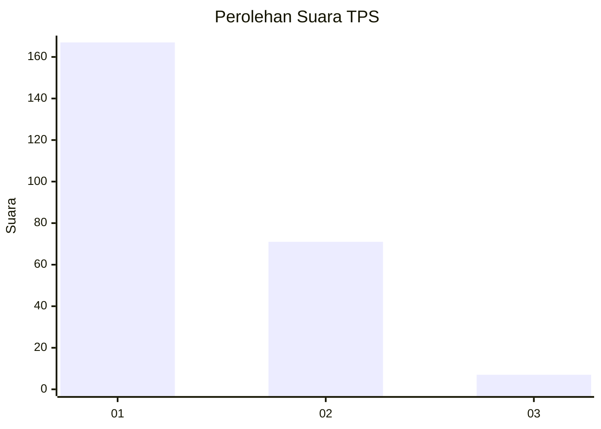
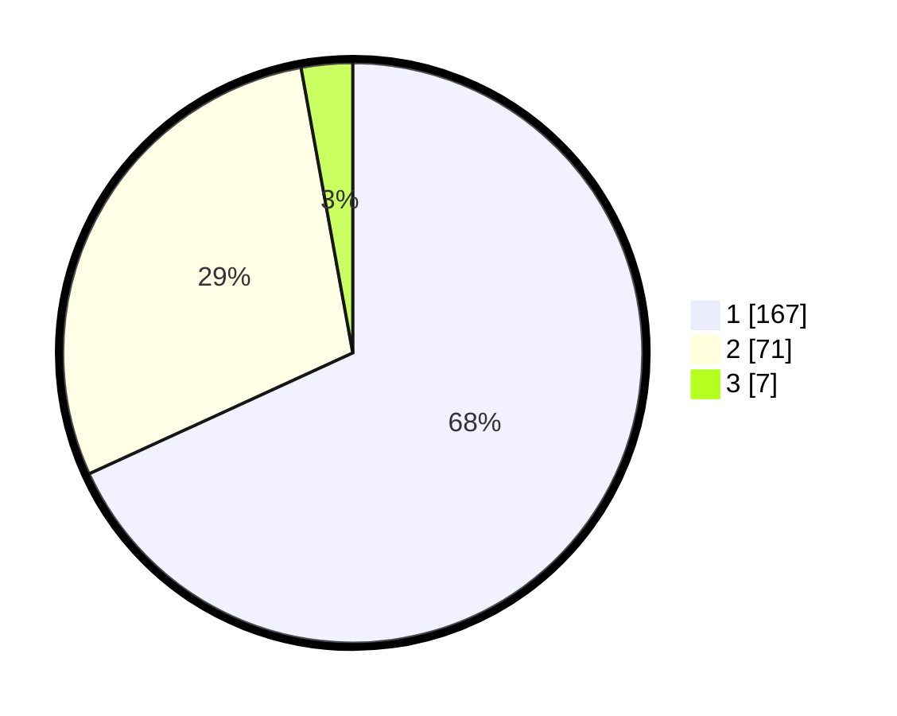

# Hasil

## Grafik

## Tabel

| No. | Nama Paslon    | Suara | Suara (raw) | Persentase |
|:--- |:-------------- | -----:| -----------:| ----------:|
| 1   | ANIES MUHAIMIN | 167   | [167][p-1]  | 68,16      |
| 2   | PRABOWO GIBRAN | 71    | [71][p-2]   | 28,98      |
| 3   | GANJAR MAHFUD  | 7     | [7][p-3]    | 2,86       |

[p-1]: https://github.com/gigit-pemilu/pemilu-2024-11-aceh/blob/main/pilpres/hitung-suara/sub/11-aceh/sub/17-bener-meriah/sub/08-bener-kelipah/sub/2005-gunung-musara/sub/001-tps/sub/paslon-1.txt
[p-2]: https://github.com/gigit-pemilu/pemilu-2024-11-aceh/blob/main/pilpres/hitung-suara/sub/11-aceh/sub/17-bener-meriah/sub/08-bener-kelipah/sub/2005-gunung-musara/sub/001-tps/sub/paslon-2.txt
[p-3]: https://github.com/gigit-pemilu/pemilu-2024-11-aceh/blob/main/pilpres/hitung-suara/sub/11-aceh/sub/17-bener-meriah/sub/08-bener-kelipah/sub/2005-gunung-musara/sub/001-tps/sub/paslon-3.txt

## Foto C Plano

https://sirekap-obj-formc.kpu.go.id/39cd/pemilu/ppwp/11/17/08/20/05/1117082005001-20240214-210713--15da75f4-178e-4192-96d3-ab7bbe3f9b66.jpg

https://sirekap-obj-formc.kpu.go.id/39cd/pemilu/ppwp/11/17/08/20/05/1117082005001-20240214-195531--c8aeefa2-91e6-4ca0-8ad1-ef160625396a.jpg

https://sirekap-obj-formc.kpu.go.id/39cd/pemilu/ppwp/11/17/08/20/05/1117082005001-20240214-211037--3a9310b1-518a-492a-b81e-406a4697131e.jpg

## Metadata

| Key        | Value               |
| ---------- | ------------------- |
| Time Stamp | 2024-02-24 22:31:28 |

