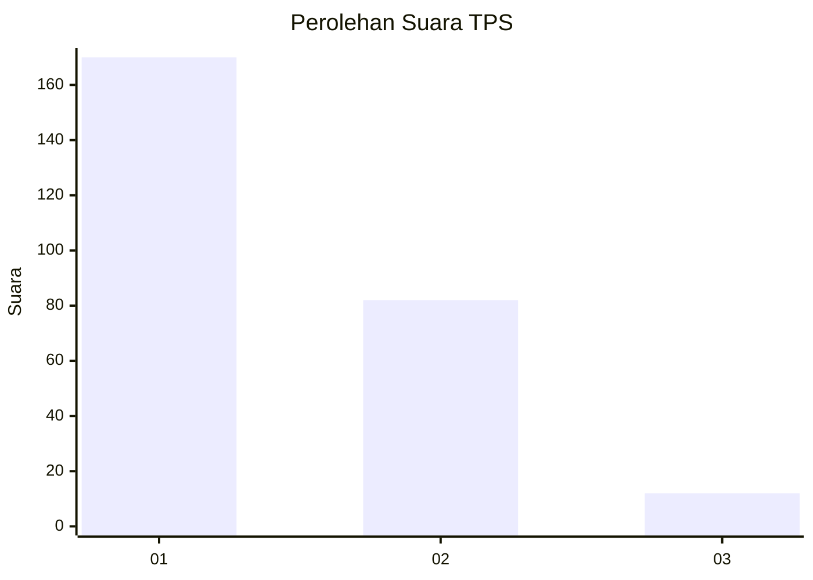
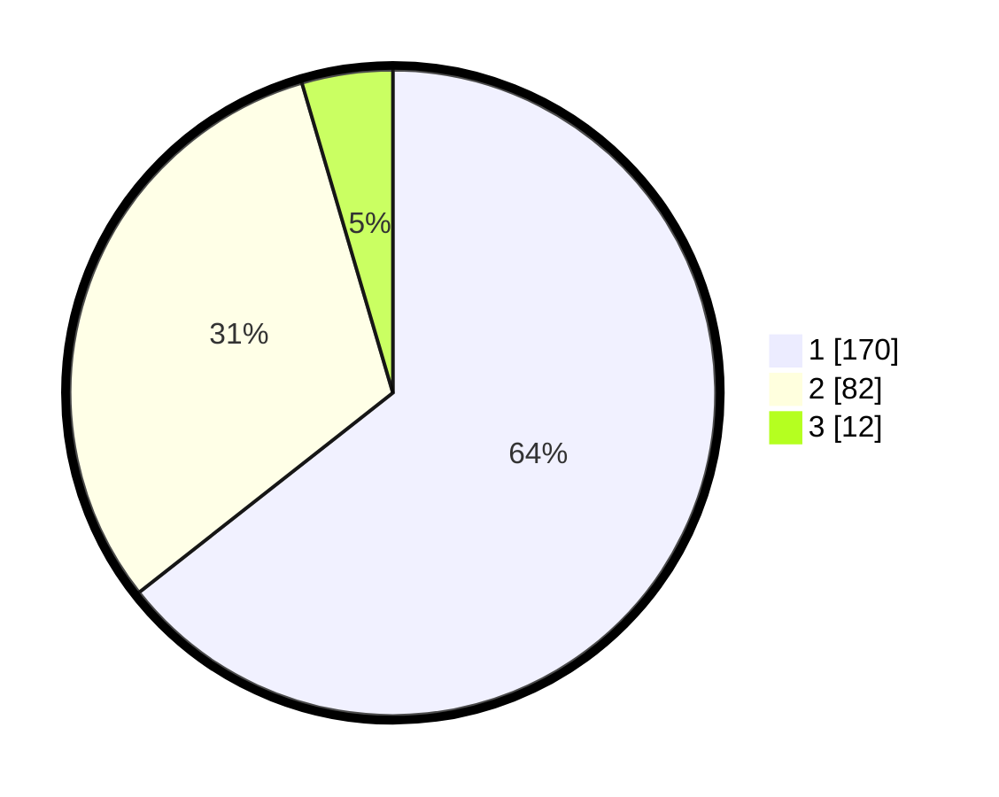

# Hasil

## Grafik

## Tabel

| No. | Nama Paslon    | Suara | Suara (raw) | Persentase |
|:--- |:-------------- | -----:| -----------:| ----------:|
| 1   | ANIES MUHAIMIN | 170   | [170][p-1]  | 64,39      |
| 2   | PRABOWO GIBRAN | 82    | [82][p-2]   | 31,06      |
| 3   | GANJAR MAHFUD  | 12    | [12][p-3]   | 4,55       |

[p-1]: https://github.com/gigit-pemilu/pemilu-2024-11-aceh/blob/main/pilpres/hitung-suara/sub/11-aceh/sub/17-bener-meriah/sub/08-bener-kelipah/sub/2009-bener-kelipah-utara/sub/001-tps/sub/paslon-1.txt
[p-2]: https://github.com/gigit-pemilu/pemilu-2024-11-aceh/blob/main/pilpres/hitung-suara/sub/11-aceh/sub/17-bener-meriah/sub/08-bener-kelipah/sub/2009-bener-kelipah-utara/sub/001-tps/sub/paslon-2.txt
[p-3]: https://github.com/gigit-pemilu/pemilu-2024-11-aceh/blob/main/pilpres/hitung-suara/sub/11-aceh/sub/17-bener-meriah/sub/08-bener-kelipah/sub/2009-bener-kelipah-utara/sub/001-tps/sub/paslon-3.txt

## Foto C Plano

https://sirekap-obj-formc.kpu.go.id/e834/pemilu/ppwp/11/17/08/20/09/1117082009001-20240215-131743--497ae076-7d0f-4e72-a872-8d405bf883d8.jpg

https://sirekap-obj-formc.kpu.go.id/e834/pemilu/ppwp/11/17/08/20/09/1117082009001-20240214-222049--70440909-64f5-496b-91eb-231e6bd62de6.jpg

https://sirekap-obj-formc.kpu.go.id/e834/pemilu/ppwp/11/17/08/20/09/1117082009001-20240215-082420--24014f4f-2444-40c9-8d0d-c7434915d025.jpg

## Metadata

| Key        | Value               |
| ---------- | ------------------- |
| Time Stamp | 2024-02-24 22:31:28 |

