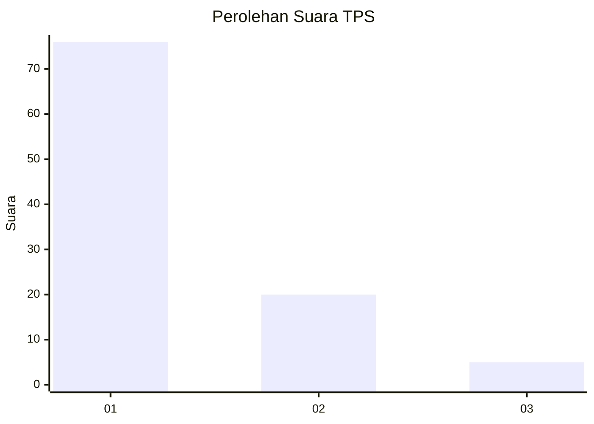
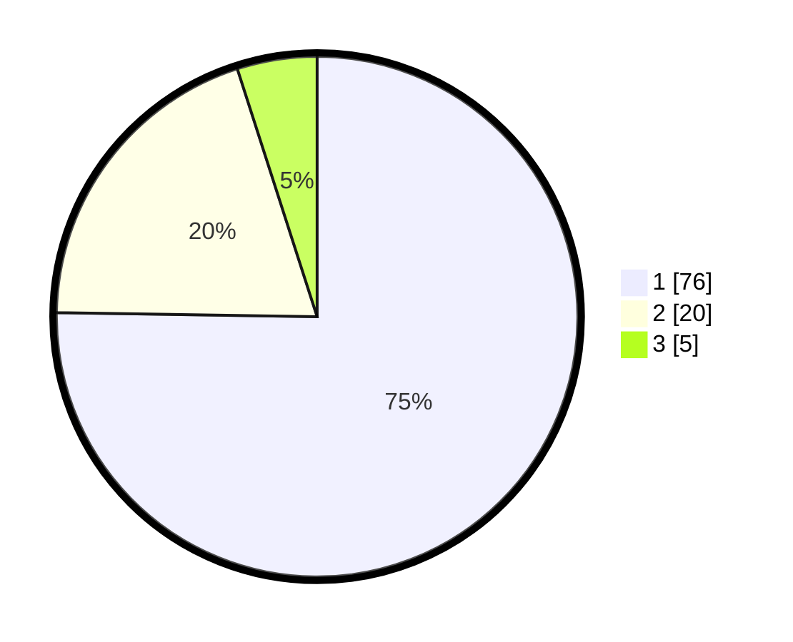

# Hasil

## Grafik

## Tabel

| No. | Nama Paslon    | Suara | Suara (raw) | Persentase |
|:--- |:-------------- | -----:| -----------:| ----------:|
| 1   | ANIES MUHAIMIN | 76    | [76][p-1]   | 75,25      |
| 2   | PRABOWO GIBRAN | 20    | [20][p-2]   | 19,80      |
| 3   | GANJAR MAHFUD  | 5     | [5][p-3]    | 4,95       |

[p-1]: https://github.com/gigit-pemilu/pemilu-2024-11-aceh/blob/main/pilpres/hitung-suara/sub/11-aceh/sub/17-bener-meriah/sub/08-bener-kelipah/sub/2009-bener-kelipah-utara/sub/003-tps/sub/paslon-1.txt
[p-2]: https://github.com/gigit-pemilu/pemilu-2024-11-aceh/blob/main/pilpres/hitung-suara/sub/11-aceh/sub/17-bener-meriah/sub/08-bener-kelipah/sub/2009-bener-kelipah-utara/sub/003-tps/sub/paslon-2.txt
[p-3]: https://github.com/gigit-pemilu/pemilu-2024-11-aceh/blob/main/pilpres/hitung-suara/sub/11-aceh/sub/17-bener-meriah/sub/08-bener-kelipah/sub/2009-bener-kelipah-utara/sub/003-tps/sub/paslon-3.txt

## Foto C Plano

https://sirekap-obj-formc.kpu.go.id/896e/pemilu/ppwp/11/17/08/20/09/1117082009003-20240214-214332--1d3af756-d192-446a-bbf4-a3f31e56f121.jpg

https://sirekap-obj-formc.kpu.go.id/896e/pemilu/ppwp/11/17/08/20/09/1117082009003-20240214-214553--add85df9-eac9-46bd-93a5-269e2658935c.jpg

https://sirekap-obj-formc.kpu.go.id/896e/pemilu/ppwp/11/17/08/20/09/1117082009003-20240214-214708--7c6e9346-af86-4645-b6e2-72dc7e21e421.jpg

## Metadata

| Key        | Value               |
| ---------- | ------------------- |
| Time Stamp | 2024-02-25 10:00:00 |

