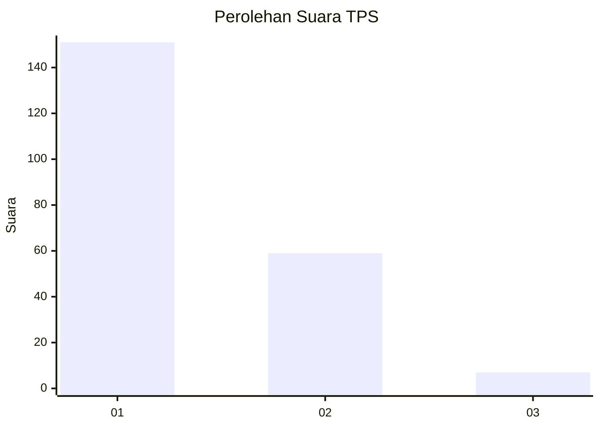
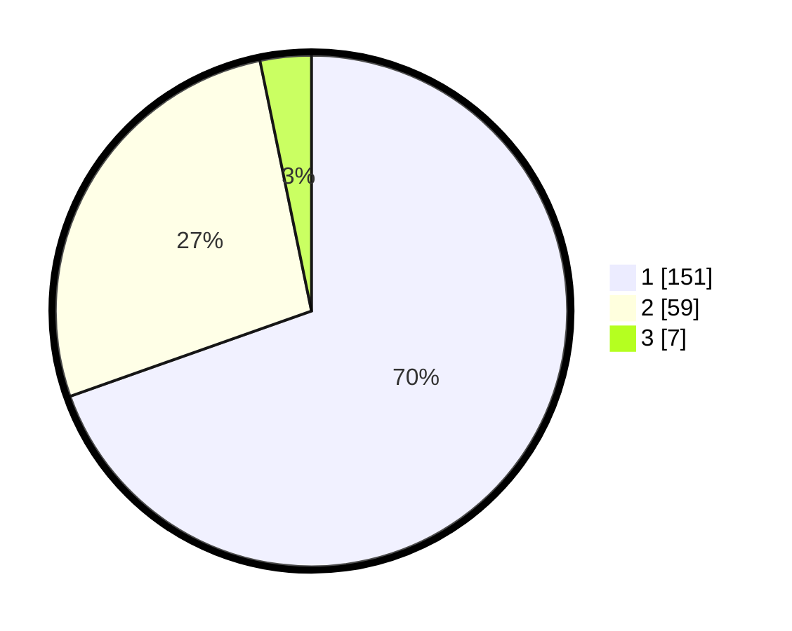

# Hasil

## Grafik

## Tabel

| No. | Nama Paslon    | Suara | Suara (raw) | Persentase |
|:--- |:-------------- | -----:| -----------:| ----------:|
| 1   | ANIES MUHAIMIN | 151   | [151][p-1]  | 69,59      |
| 2   | PRABOWO GIBRAN | 59    | [59][p-2]   | 27,19      |
| 3   | GANJAR MAHFUD  | 7     | [7][p-3]    | 3,23       |

[p-1]: https://github.com/gigit-pemilu/pemilu-2024-11-aceh/blob/main/pilpres/hitung-suara/sub/11-aceh/sub/17-bener-meriah/sub/08-bener-kelipah/sub/2010-lot-bener-kelipah/sub/002-tps/sub/paslon-1.txt
[p-2]: https://github.com/gigit-pemilu/pemilu-2024-11-aceh/blob/main/pilpres/hitung-suara/sub/11-aceh/sub/17-bener-meriah/sub/08-bener-kelipah/sub/2010-lot-bener-kelipah/sub/002-tps/sub/paslon-2.txt
[p-3]: https://github.com/gigit-pemilu/pemilu-2024-11-aceh/blob/main/pilpres/hitung-suara/sub/11-aceh/sub/17-bener-meriah/sub/08-bener-kelipah/sub/2010-lot-bener-kelipah/sub/002-tps/sub/paslon-3.txt

## Foto C Plano

https://sirekap-obj-formc.kpu.go.id/c433/pemilu/ppwp/11/17/08/20/10/1117082010002-20240215-162159--4f50971f-db63-47c9-ada4-8ff08e67536e.jpg

https://sirekap-obj-formc.kpu.go.id/c433/pemilu/ppwp/11/17/08/20/10/1117082010002-20240215-163449--756fda94-deb6-499b-900b-a6efffec02fd.jpg

https://sirekap-obj-formc.kpu.go.id/c433/pemilu/ppwp/11/17/08/20/10/1117082010002-20240215-165543--e348a87d-7dc9-47bf-abda-105fcf508871.jpg

## Metadata

| Key        | Value               |
| ---------- | ------------------- |
| Time Stamp | 2024-02-24 22:31:28 |

