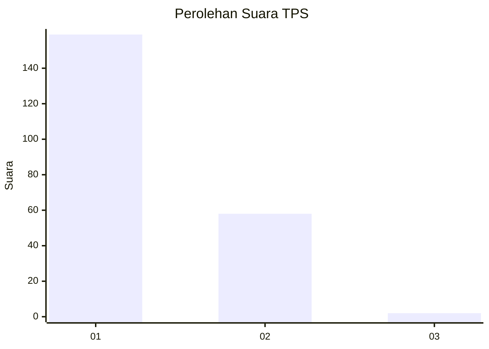
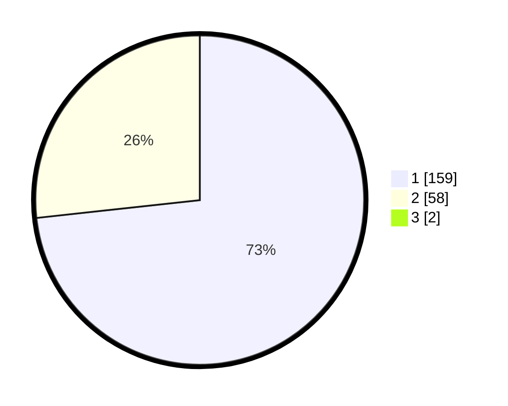

# Hasil

## Grafik

## Tabel

| No. | Nama Paslon    | Suara | Suara (raw) | Persentase |
|:--- |:-------------- | -----:| -----------:| ----------:|
| 1   | ANIES MUHAIMIN | 159   | [159][p-1]  | 72,60      |
| 2   | PRABOWO GIBRAN | 58    | [58][p-2]   | 26,48      |
| 3   | GANJAR MAHFUD  | 2     | [2][p-3]    | 0,91       |

[p-1]: https://github.com/gigit-pemilu/pemilu-2024-11-aceh/blob/main/pilpres/hitung-suara/sub/11-aceh/sub/17-bener-meriah/sub/08-bener-kelipah/sub/2012-nosar-baru/sub/001-tps/sub/paslon-1.txt
[p-2]: https://github.com/gigit-pemilu/pemilu-2024-11-aceh/blob/main/pilpres/hitung-suara/sub/11-aceh/sub/17-bener-meriah/sub/08-bener-kelipah/sub/2012-nosar-baru/sub/001-tps/sub/paslon-2.txt
[p-3]: https://github.com/gigit-pemilu/pemilu-2024-11-aceh/blob/main/pilpres/hitung-suara/sub/11-aceh/sub/17-bener-meriah/sub/08-bener-kelipah/sub/2012-nosar-baru/sub/001-tps/sub/paslon-3.txt

## Foto C Plano

https://sirekap-obj-formc.kpu.go.id/3aee/pemilu/ppwp/11/17/08/20/12/1117082012001-20240215-030926--2ccdd6fd-d8b9-4169-b111-f4e5d54dcd7d.jpg

https://sirekap-obj-formc.kpu.go.id/3aee/pemilu/ppwp/11/17/08/20/12/1117082012001-20240215-032334--53f5744f-86a7-4938-9531-a8bf852866da.jpg

https://sirekap-obj-formc.kpu.go.id/3aee/pemilu/ppwp/11/17/08/20/12/1117082012001-20240215-030735--b285f39e-a541-49ae-870c-2fe61c23d4c1.jpg

## Metadata

| Key        | Value               |
| ---------- | ------------------- |
| Time Stamp | 2024-02-24 22:31:28 |

