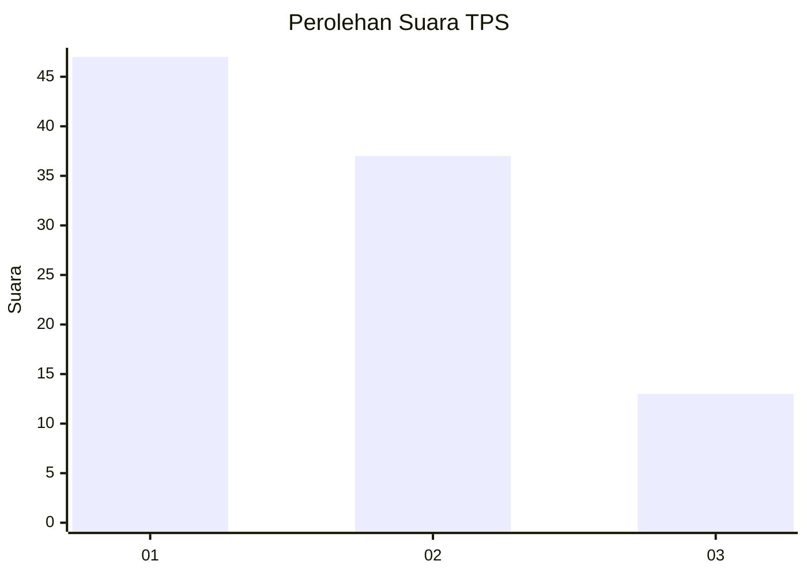
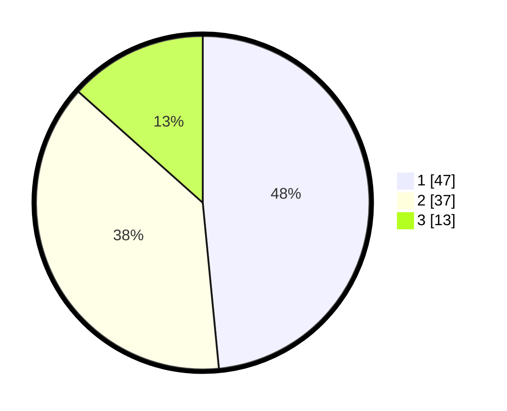

# Hasil

## Grafik

## Tabel

| No. | Nama Paslon    | Suara | Suara (raw) | Persentase |
|:--- |:-------------- | -----:| -----------:| ----------:|
| 1   | ANIES MUHAIMIN | 47    | [47][p-1]   | 48,45      |
| 2   | PRABOWO GIBRAN | 37    | [37][p-2]   | 38,14      |
| 3   | GANJAR MAHFUD  | 13    | [13][p-3]   | 13,40      |

[p-1]: https://github.com/gigit-pemilu/pemilu-2024-11-aceh/blob/main/pilpres/hitung-suara/sub/11-aceh/sub/17-bener-meriah/sub/09-mesidah/sub/2004-pantan-kuli/sub/001-tps/sub/paslon-1.txt
[p-2]: https://github.com/gigit-pemilu/pemilu-2024-11-aceh/blob/main/pilpres/hitung-suara/sub/11-aceh/sub/17-bener-meriah/sub/09-mesidah/sub/2004-pantan-kuli/sub/001-tps/sub/paslon-2.txt
[p-3]: https://github.com/gigit-pemilu/pemilu-2024-11-aceh/blob/main/pilpres/hitung-suara/sub/11-aceh/sub/17-bener-meriah/sub/09-mesidah/sub/2004-pantan-kuli/sub/001-tps/sub/paslon-3.txt

## Foto C Plano

https://sirekap-obj-formc.kpu.go.id/bcc6/pemilu/ppwp/11/17/09/20/04/1117092004001-20240216-131015--401db3ee-0965-4c50-af51-b607fc71ddbe.jpg

https://sirekap-obj-formc.kpu.go.id/bcc6/pemilu/ppwp/11/17/09/20/04/1117092004001-20240215-003111--c10ff21d-d238-48a5-ab85-cfe2ac2eec3c.jpg

https://sirekap-obj-formc.kpu.go.id/bcc6/pemilu/ppwp/11/17/09/20/04/1117092004001-20240216-131016--c99326ea-03d3-486e-a7e3-ba080c5d60d4.jpg

## Metadata

| Key        | Value               |
| ---------- | ------------------- |
| Time Stamp | 2024-02-16 13:30:32 |

## DATA PEMILIH TETAP

Jumlah pemilih dalam DPT: **107**.
 * L: **59**.
 * P: **48**.

## DATA PENGGUNA HAK PILIH

Jumlah pengguna hak pilih dalam DPT: **94**.
 * L: **50**.
 * P: **44**.

Jumlah pengguna hak pilih dalam DPTb: **3**.
 * L: **2**.
 * P: **1**.

Jumlah pengguna hak pilih dalam DPK: **2**.
 * L: **1**.
 * P: **1**.

Jumlah pengguna hak pilih: **99**.
 * L: **53**.
 * P: **46**.

## JUMLAH SUARA SAH DAN TIDAK SAH

JUMLAH SELURUH SUARA SAH: **97**.

JUMLAH SUARA TIDAK SAH: **2**.

JUMLAH SELURUH SUARA SAH DAN SUARA TIDAK SAH: **99**.

